# Diagramas extraídos del código

Estos diagramas **no** describen el estado destino: describen lo que hoy está
escrito en el repositorio, rama `dev`, commit `aef8df5`. Se extrajeron leyendo
`backend/`, `frontend/`, las migraciones de EF Core, `infra/` y
`.github/workflows/`.

Para el diseño destino (módulos que todavía no existen, DR en segunda región,
portal cautivo Aruba) ver [`diagramas.md`](diagramas.md). Donde los dos
documentos se contradicen, este manda sobre lo que ya está construido.

---

## 1. Backend — .NET 10, monolito modular

Fuente: `backend/CSH.slnx`, `CSH.Host/Program.cs`, `CSH.Usuarios/`, `CSH.Shared/`.

Hoy existen tres proyectos y **un solo módulo de negocio** (`CSH.Usuarios`) con
**una sola feature** (`ObtenerPerfil`).

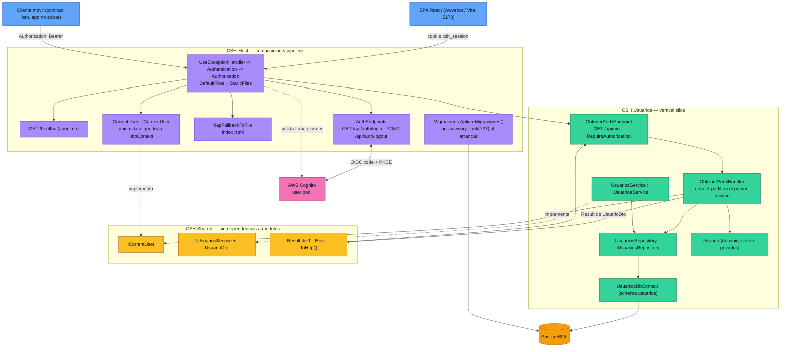

### Selección de esquema de autenticación

Fuente: `CSH.Host/Auth/AuthServiceCollectionExtensions.cs`. El policy scheme
`CookieOrBearer` decide por request mirando el header `Authorization`.

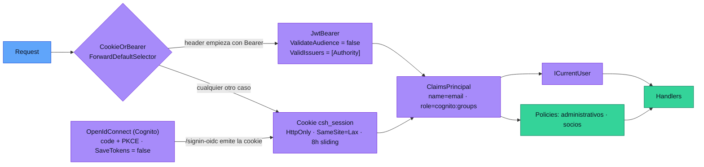

Detalle que vale registrar: `OnRedirectToLogin` devuelve **401** en vez de
redirigir cuando la ruta empieza con `/api`, y **403** en access denied. Por eso
la SPA puede llamar `/api/me` sin sesión y tratar el 401 como "no logueado".

### Flujo real de `GET /api/me`

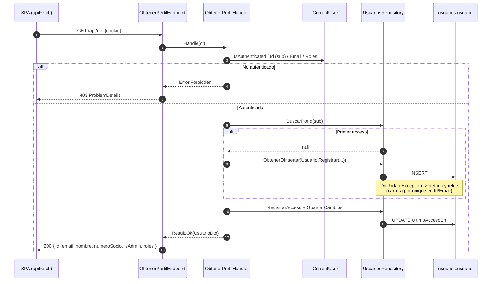

---

## 2. Frontend — React 19 + Vite

Fuente: `frontend/`. Sin router, sin gestor de estado, sin librería de datos:
una sola pantalla (`App.tsx`) con `useState` + `useEffect`.

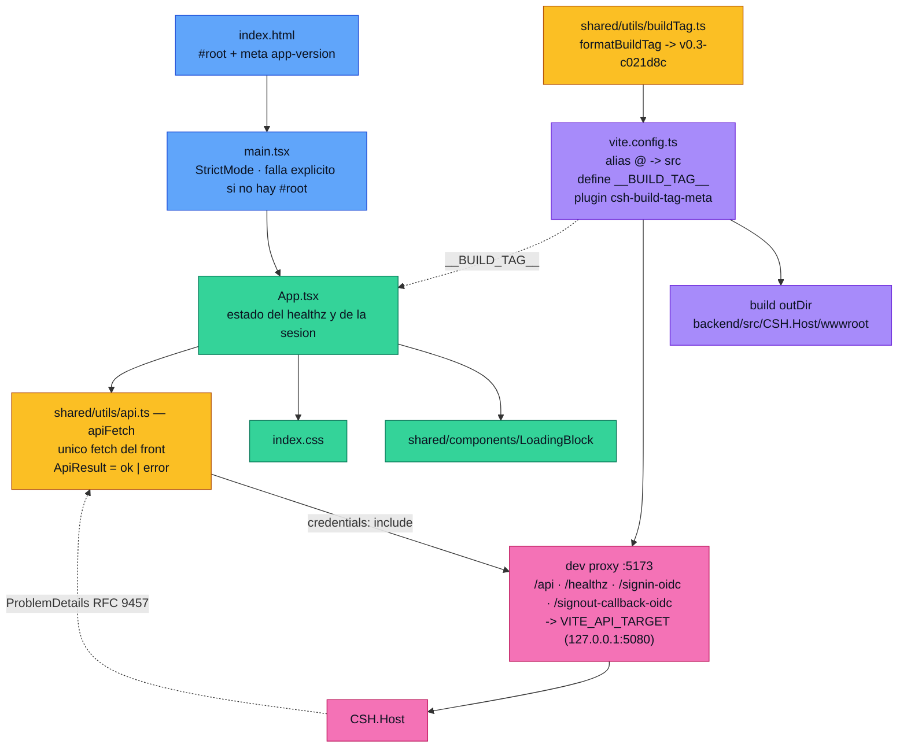

### Contrato HTTP que el front asume

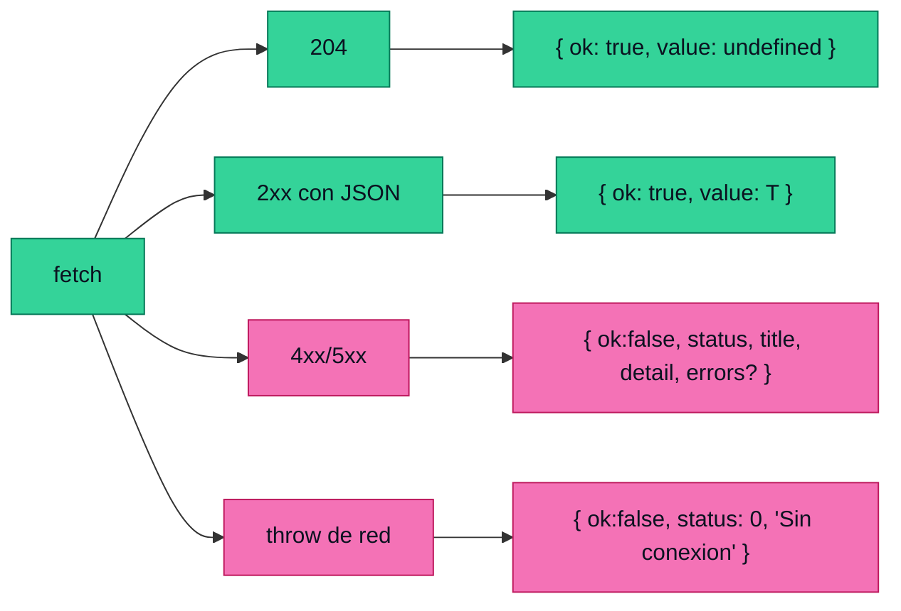

En `App.tsx` el 401 de `/api/me` se trata aparte: no es error visible, es
"no hay sesión" y se muestra el botón de login.

---

## 3. Base de datos

Fuente: `CSH.Usuarios/Infrastructure/` + migración `20260819204838_Init`.
Un esquema por módulo; hoy existe **un** esquema con **una** tabla.

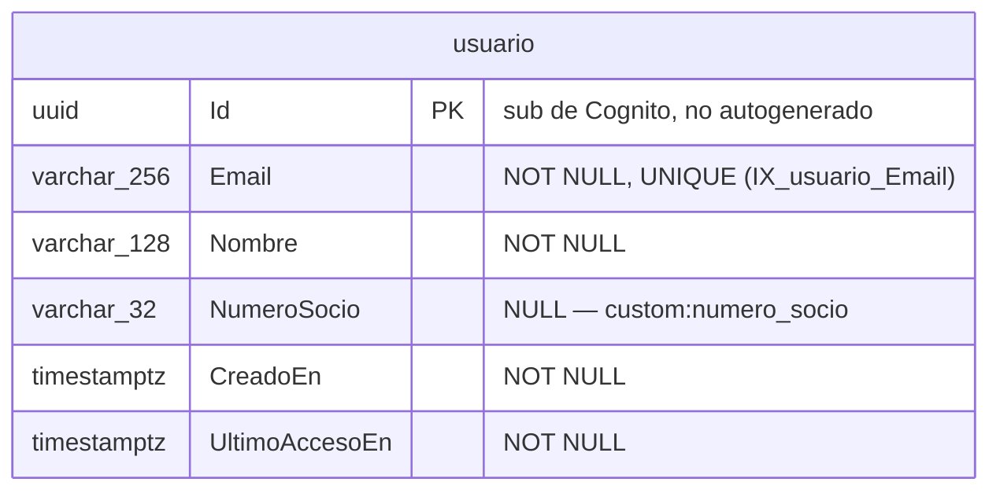

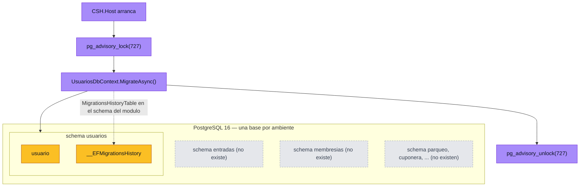

El lock serializa el arranque: con varias tasks Fargate subiendo a la vez, solo
una aplica la migración y las demás esperan.

**Ambientes:** cada ambiente tiene su propio cluster Aurora
(`infra/modules/datos`), con la clave del usuario maestro administrada por RDS
en Secrets Manager — nunca en el state de Terraform. En local, `docker-compose.dev.yml`
levanta `postgres:16-alpine` con base `csh_dev`.

---

## 4. Infraestructura AWS

Fuente: `infra/`. **El código es ECS Fargate, no EC2 + Auto Scaling Group.**
`diagramas.md` §5 todavía muestra ASG con warm pool y AMI horneada; eso quedó
desactualizado respecto a lo que hoy hace `terraform apply`.

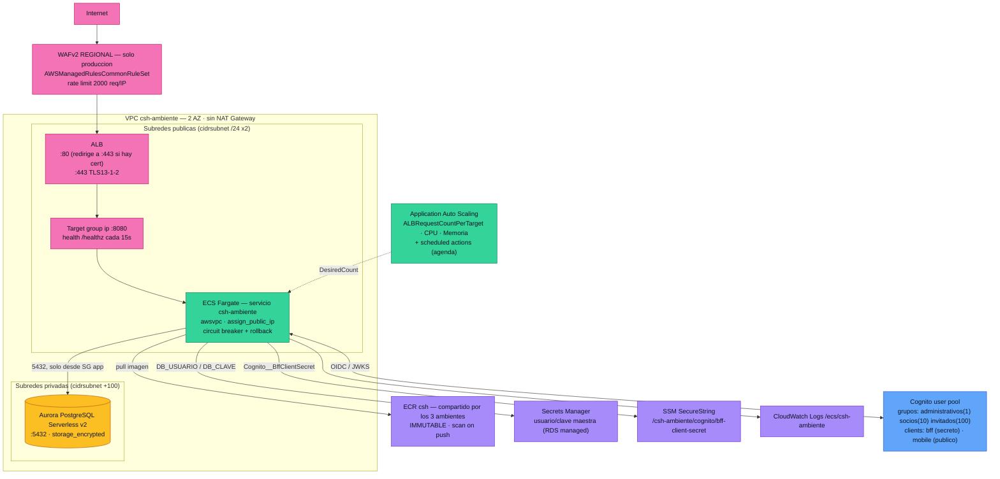

### Cadena de security groups

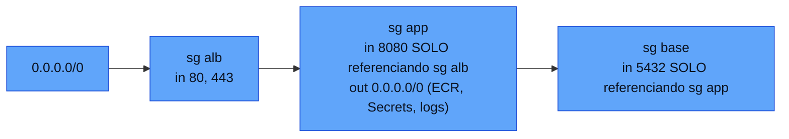

Las tasks tienen IP pública (no hay NAT Gateway, decisión de costo), pero el
security group solo acepta entrada desde el ALB.

### Composición de módulos Terraform

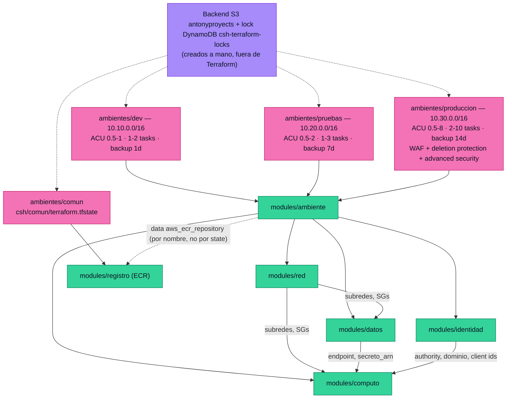

---

## 5. CI/CD

Fuente: `.github/workflows/`. Hay dos caminos de deploy que **no comparten
artefacto**: `dev` despliega la imagen .NET nueva por Podman; `main` sigue
desplegando la app Node vieja por systemd.

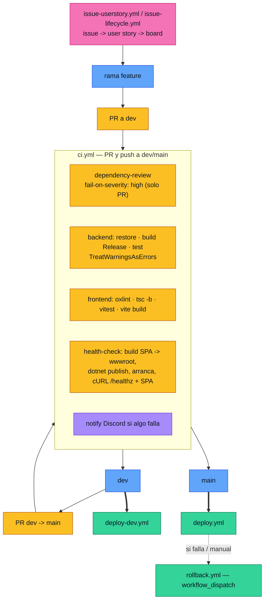

### `deploy-dev.yml` — push a `dev`

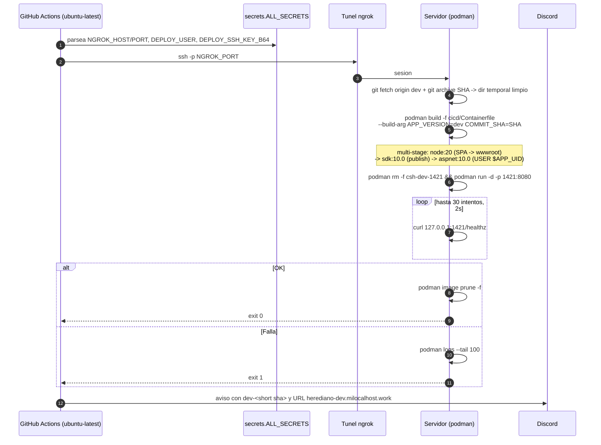

### `deploy.yml` — push a `main` (stack Node, todavía)

```mermaid
flowchart LR
    classDef paso fill:#34d399,color:#0b1220,stroke:#047857
    classDef alerta fill:#a78bfa,color:#0b1220,stroke:#6d28d9
    classDef fs fill:#fbbf24,color:#0b1220,stroke:#b45309

    Push["push a main"]:::paso
    D1["Discord: empieza"]:::alerta
    Ver["version = max(release 0.N) + 1<br/>(gh release list)"]:::paso
    Scp["scp app.env -> shared/.env (chmod 600)"]:::paso
    Arch["git archive SHA -> releases/0.N<br/>rechaza si el directorio ya existe"]:::fs
    Bld["npm ci && APP_VERSION/COMMIT_SHA npm run build"]:::paso
    Man["RELEASE_MANIFEST.json"]:::fs
    Ln["ln -sfn releases/0.N current"]:::fs
    Sys["systemd --user csh.service<br/>restart · WorkingDirectory=current"]:::paso
    HC["curl 127.0.0.1:8088/healthz (30 x 2s)"]:::paso
    Rel["GitHub release marker 0.N"]:::paso
    D2["Discord: resultado"]:::alerta
    RB["rollback.yml: elige release previo<br/>y reapunta el symlink current"]:::paso

    Push --> D1 --> Ver --> Scp --> Arch --> Bld --> Man --> Ln --> Sys --> HC --> Rel --> D2
    HC -.->|"falla"| RB
```

Estructura en el servidor de producción:

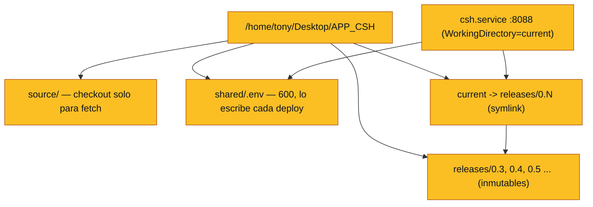

---

## 6. Brechas entre el código y `diagramas.md`

| Tema | `diagramas.md` (destino) | Lo que hay en el código |
|---|---|---|
| Módulos de negocio | 10 (`Entradas`, `Parqueo`, `Membresias`, `Red`, …) | 1: `CSH.Usuarios`, con la feature `ObtenerPerfil` |
| Cómputo AWS | EC2 + ASG + warm pool + AMI horneada | ECS Fargate + Application Auto Scaling (sin warm pool) |
| DR segunda región | Aurora Global, Route53 failover, CRR de S3 | no existe: un solo `region = us-east-1` por ambiente |
| Route53 / dominio | en el diagrama | no hay recurso Route53; el ALB expone su DNS y el cert es opcional (`certificado_arn`) |
| S3 de estáticos | en el diagrama | no existe: la SPA se sirve desde `wwwroot` dentro del contenedor |
| Deploy de producción | bake de AMI + instance refresh | `main` sigue en el stack Node con systemd y symlinks |
| Comunicación por eventos | `mediator.Publish` de `EntradaCompradaEvent` | no hay mediator ni eventos; solo el contrato `IUsuariosService` |
| Stripe, WhatsApp, correo, Aruba | integraciones del contexto | ninguna referencia en el código |
| Frontend por bounded context | diagrama vacío en §4 | una pantalla, sin router ni store |
