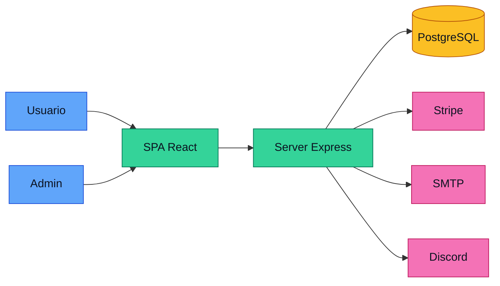
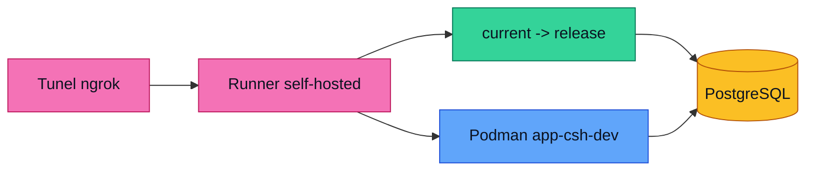
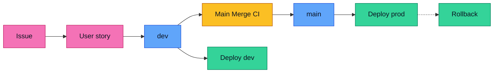

# Diagramas

Mermaid, actualizados en cada move de `dev` a `main`. Issue relacionado: [#45](https://github.com/S3-Simple-Software-Solutions/CSH/issues/45).

## Arquitectura

## Infraestructura

## CI/CD

