# Diagramas

Mermaid. Describen el **estado destino** del proyecto: monolito modular .NET 10 +
React 19 (ver [`harness_DEV.md`](harness_DEV.md)) desplegado sobre AWS con DR en
una segunda región (ver [`infra.md`](infra.md)).

Lo que corre hoy (app Node/Express sobre túnel ngrok) está al final, en
[§7 Estado actual](#7-estado-actual-transitorio), marcado como transitorio.

Se actualizan en cada move de `dev` a `main`. Issue relacionado:
[#45](https://github.com/S3-Simple-Software-Solutions/CSH/issues/45).

---

## 1. Contexto — quién usa la plataforma y con qué habla

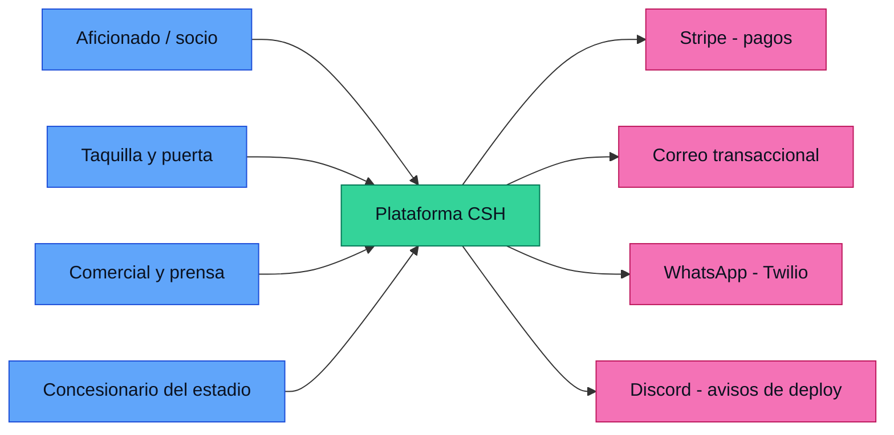

---

## 2. Arquitectura de la solución — monolito modular

Un solo proceso desplegable con **dos clientes**: la SPA del sitio y la app
móvil. Cada bounded context es un `.csproj` separado: el compilador enforcea los
límites. `CSH.Host` es lo único que conoce HTTP — compone los módulos, autentica
y traduce errores a Problem Details.

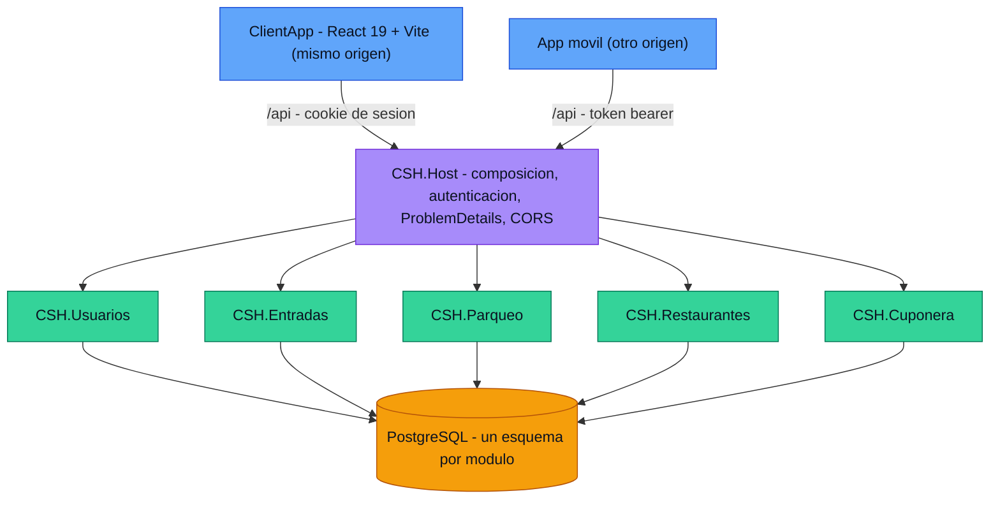

Los cinco módulos referencian `CSH.Shared` — `Result<T>`, `Error`,
`ICurrentUser`, contratos y eventos. No está dibujado a propósito: sería una
arista desde cada módulo hacia el mismo nodo y no agrega información. La regla
la dice mejor en una línea: **todos dependen de Shared y Shared no depende de
nadie.**

### El móvil no cambia los módulos, cambia el borde

Los handlers reciben `ICurrentUser` y no saben por dónde entró la request. Por
eso agregar un cliente móvil no toca ningún módulo: se agrega un esquema de
autenticación en `CSH.Host` y ambos terminan en el mismo `ClaimsPrincipal`.

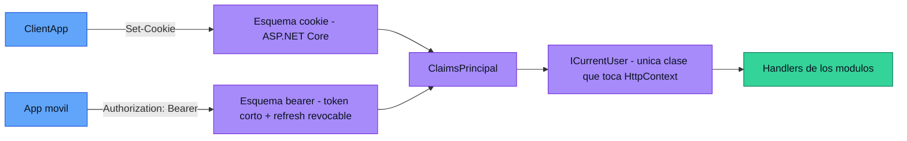

Lo que sí cambia al entrar el móvil:

- **La decisión de auth se reabre.** `harness_DEV_backend.md` §6 eligió cookie
  sobre JWT y dejó anotado que una app móvil sería lo que cambiara esa decisión.
  La cookie se queda para la web; el móvil necesita bearer.
- **La revocación no se negocia.** El motivo de haber descartado JWT era poder
  cortar acceso ya (cuenta comprometida, fraude en una apertura de venta). Ese
  motivo sigue vivo: el token del móvil va corto y el refresh se revoca contra
  la base — no un JWT largo sin punto de corte.
- **CORS deja de ser trivial.** Hoy la SPA es mismo origen y no hay política que
  mantener; el móvil obliga a una lista explícita de orígenes y métodos.
- **El contrato de la API pasa a ser público.** Una app instalada no se
  actualiza cuando uno hace deploy: hay que versionar (`/api/v1`), publicar
  OpenAPI y dejar de romper endpoints sin período de convivencia.
- **Cambio de alcance formal.** El acta §5 tiene las apps móviles nativas
  *fuera* de alcance; entra por control de cambios (acta §15).

### Dentro de un módulo — vertical slices

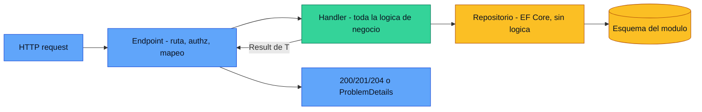

---

## 3. Comunicación entre módulos

Dos patrones, nunca una referencia directa entre módulos.

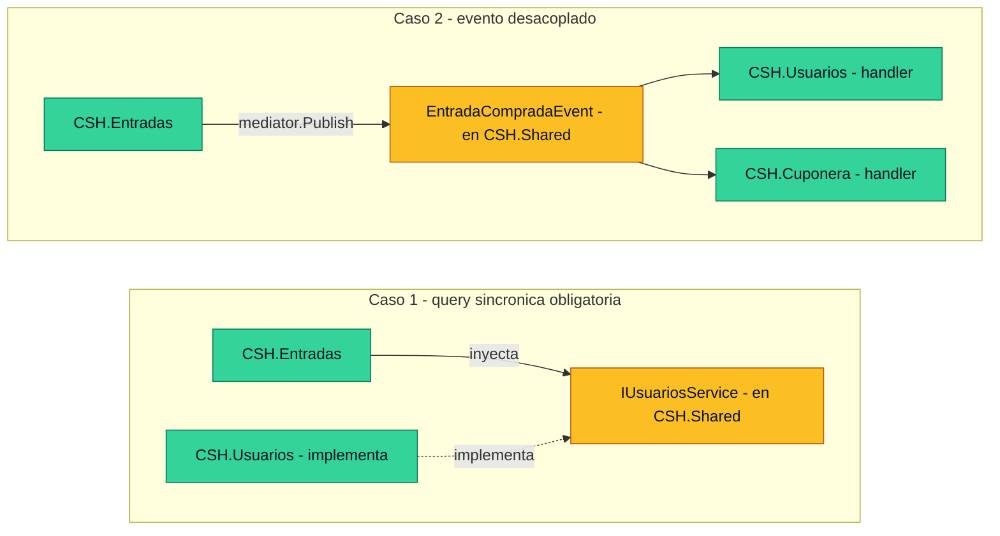

---

## 4. Frontend — espeja los bounded contexts

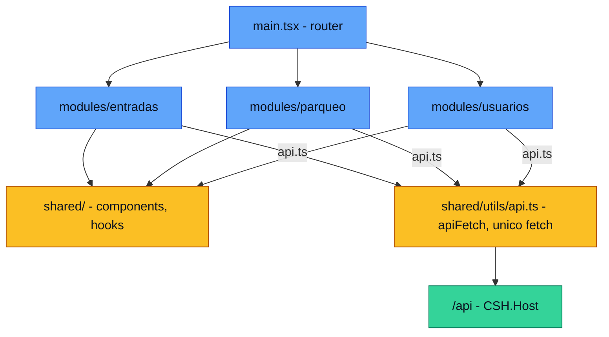

---

## 5. Infraestructura destino — AWS región primaria ("blue")

Corresponde a [`infra.md` §Decisiones](infra.md). Sin NAT Gateway: las instancias
viven en subred pública y el security group solo acepta tráfico del ALB.

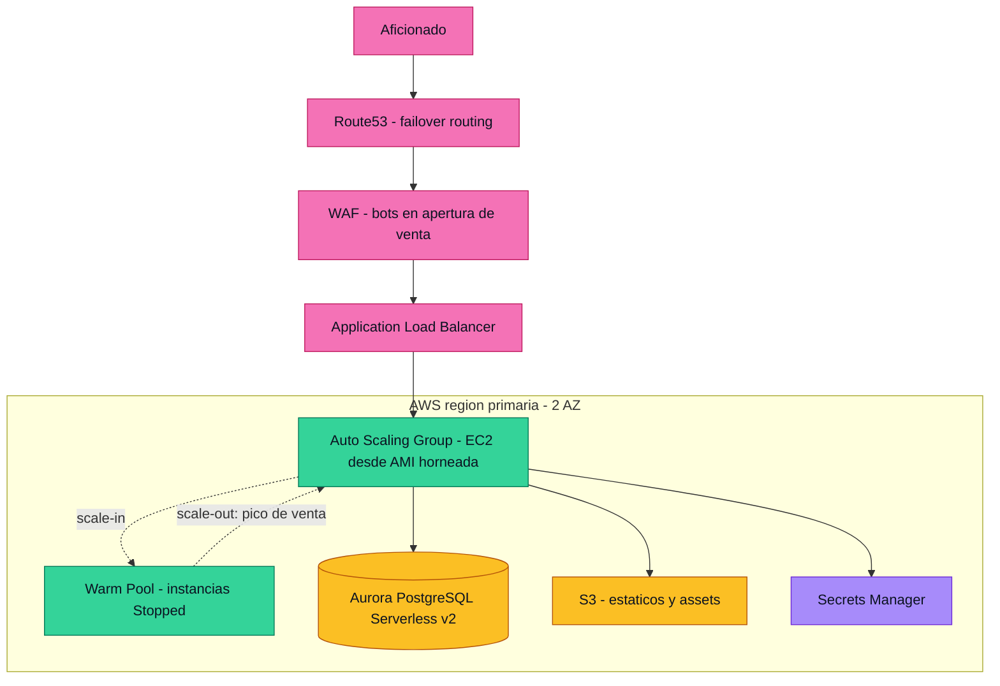

### Cómo escala en una apertura de venta

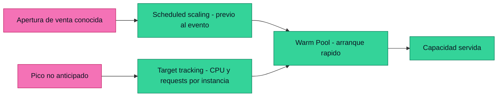

---

## 6. DR — segunda región AWS ("green"), opción recomendada

Cubre una interrupción regional de AWS. Failover automático posible; **failback
siempre manual**, por riesgo de conflicto de escrituras.

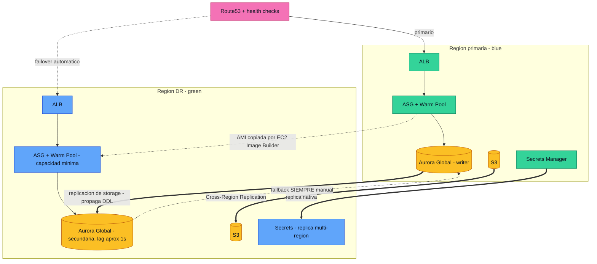

---

## 7. CI/CD

Flujo del harness: la feature va a `dev`, `dev` despliega solo, y únicamente
`dev` abre PR a `main`. Todo deploy anuncia versión, cambios y URL
([`harness.md` §10](harness.md)).

```mermaid
flowchart LR
    classDef issue fill:#f472b6,color:#0b1220,stroke:#be185d
    classDef rama fill:#60a5fa,color:#0b1220,stroke:#1d4ed8
    classDef ci fill:#fbbf24,color:#0b1220,stroke:#b45309
    classDef deploy fill:#34d399,color:#0b1220,stroke:#047857

    Issue[Issue / user story]:::issue
    Feature[Rama feature]:::rama
    PRdev[PR a dev]:::ci
    CI["CI: dotnet build + test, typecheck, vitest, build front"]:::ci
    Dev[dev]:::rama
    DeployDev[Deploy dev - herediano-dev]:::deploy
    PRmain[PR dev a main]:::ci
    Main[main]:::rama
    Bake[Bake de AMI por release]:::deploy
    Refresh[Instance refresh del ASG]:::deploy
    Prod[Produccion]:::deploy
    Rollback[Rollback - Launch Template anterior]:::deploy
    Aviso[Aviso Discord - version, cambios, URL]:::deploy

    Issue --> Feature --> PRdev --> CI --> Dev --> DeployDev --> Aviso
    Dev --> PRmain --> CI
    PRmain --> Main --> Bake --> Refresh --> Prod --> Aviso
    Prod -.->|falla| Rollback
```

---

## 8. Flujo crítico — compra de entrada

El punto donde se concentra el riesgo del proyecto: dos aficionados peleando la
misma butaca en una apertura de venta, más el webhook de Stripe que puede llegar
duplicado o antes que la redirección del usuario.

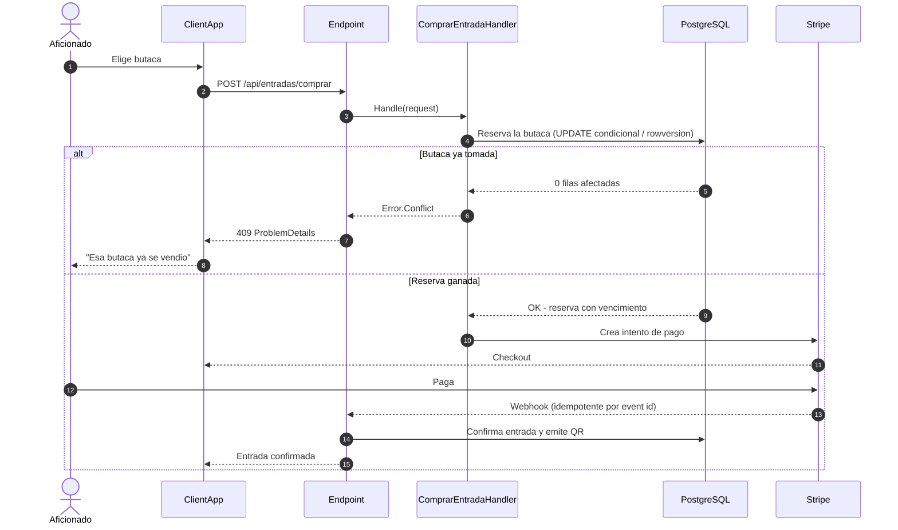

---

## 9. Estado actual (transitorio)

Lo que está corriendo hoy, **antes** de la reconstrucción: app Node/Express
servida por systemd, expuesta por un túnel ngrok hacia el runner self-hosted.
Este diagrama existe para saber de dónde salimos; desaparece cuando el destino
de §5 esté en pie.

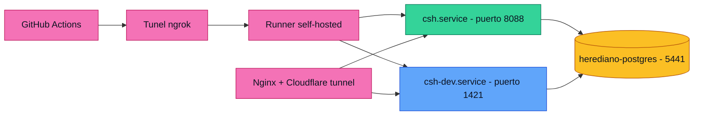

**Riesgos vigentes de este montaje** (ver acta §12): el túnel ngrok como
dependencia del despliegue (R8), y la separación de bases de datos entre
ambientes (R1), hoy resuelta solo parcialmente vía `DATABASE_URL_DEV`.
