# Diagramas

Estado destino: monolito modular .NET 10 + React 19 ([`harness_DEV.md`](harness_DEV.md))
sobre AWS con DR en segunda región ([`infra.md`](infra.md)). Se actualizan en cada
move de `dev` a `main`. Issue: [#45](https://github.com/S3-Simple-Software-Solutions/CSH/issues/45).

---

## 1. Contexto

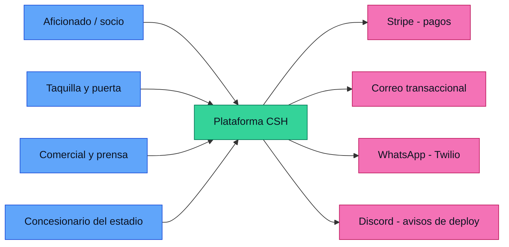

---

## 2. Arquitectura de la solución — monolito modular

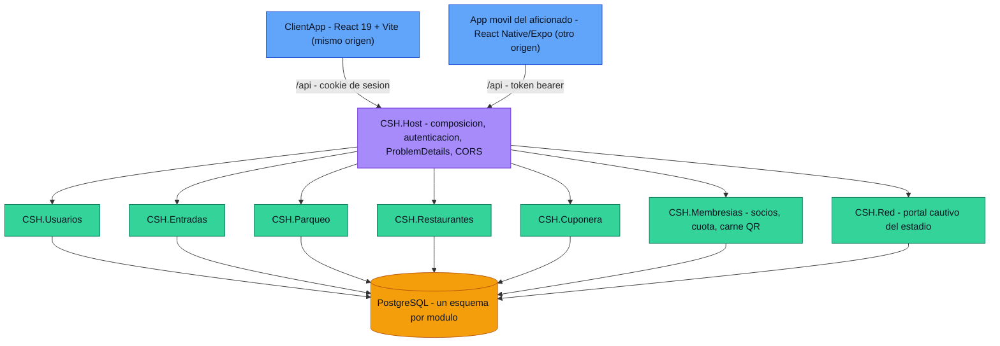

### Autenticación por tipo de cliente

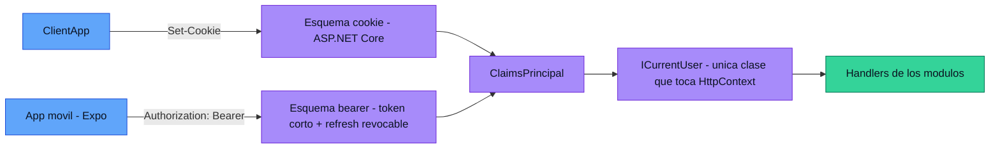

### Dentro de un módulo — vertical slice

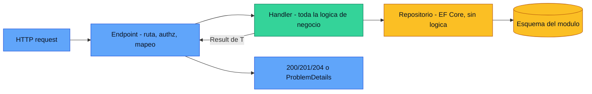

---

## 3. Comunicación entre módulos

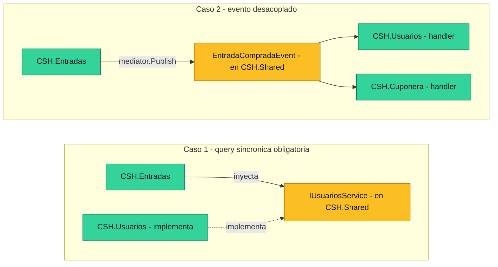

---

## 4. Frontend — espeja los bounded contexts

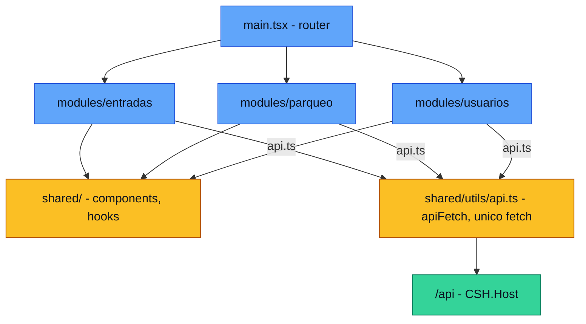

### Contrato compartido con el móvil

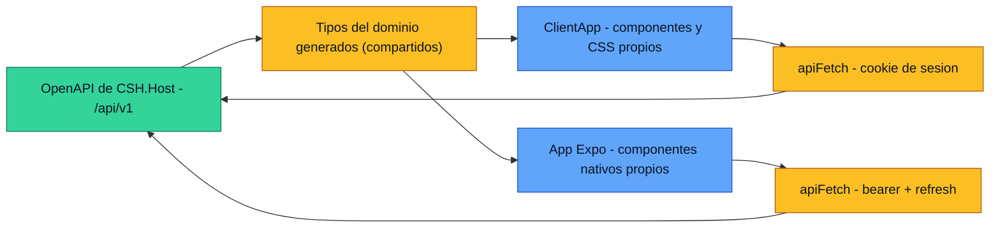

---

## 5. Infraestructura destino — AWS región primaria ("blue")

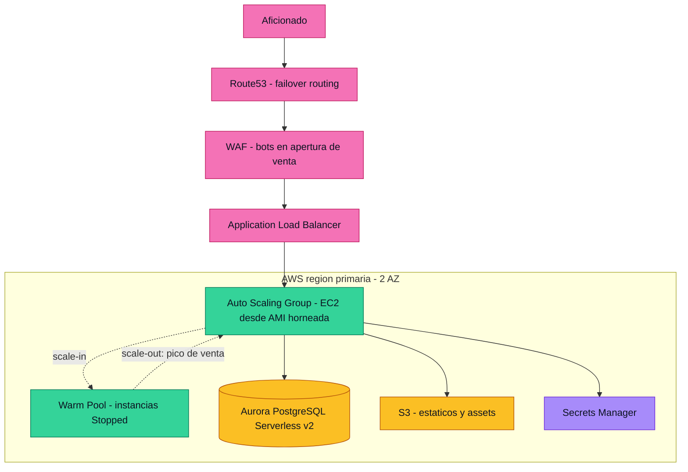

### Escalado en una apertura de venta

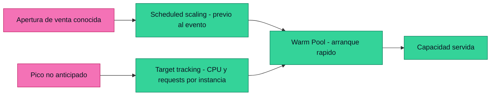

---

## 6. DR — segunda región AWS ("green")

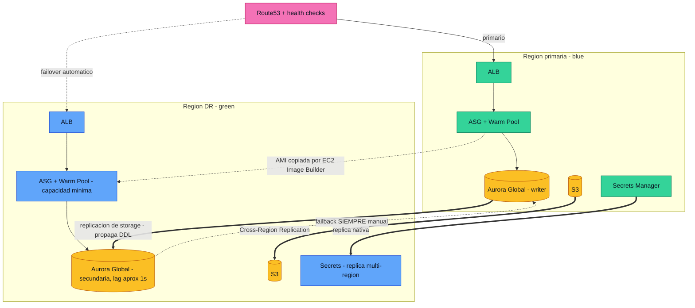

---

## 7. CI/CD

```mermaid
flowchart LR
    classDef issue fill:#f472b6,color:#0b1220,stroke:#be185d
    classDef rama fill:#60a5fa,color:#0b1220,stroke:#1d4ed8
    classDef ci fill:#fbbf24,color:#0b1220,stroke:#b45309
    classDef deploy fill:#34d399,color:#0b1220,stroke:#047857

    Issue[Issue / user story]:::issue
    Feature[Rama feature]:::rama
    PRdev[PR a dev]:::ci
    CI["CI: dotnet build + test, typecheck, vitest, build front"]:::ci
    Dev[dev]:::rama
    DeployDev[Deploy dev - herediano-dev]:::deploy
    PRmain[PR dev a main]:::ci
    Main[main]:::rama
    Bake[Bake de AMI por release]:::deploy
    Refresh[Instance refresh del ASG]:::deploy
    Prod[Produccion]:::deploy
    Rollback[Rollback - Launch Template anterior]:::deploy
    Aviso[Aviso Discord - version, cambios, URL]:::deploy

    Issue --> Feature --> PRdev --> CI --> Dev --> DeployDev --> Aviso
    Dev --> PRmain --> CI
    PRmain --> Main --> Bake --> Refresh --> Prod --> Aviso
    Prod -.->|falla| Rollback
```

---

## 8. Flujo crítico — compra de entrada

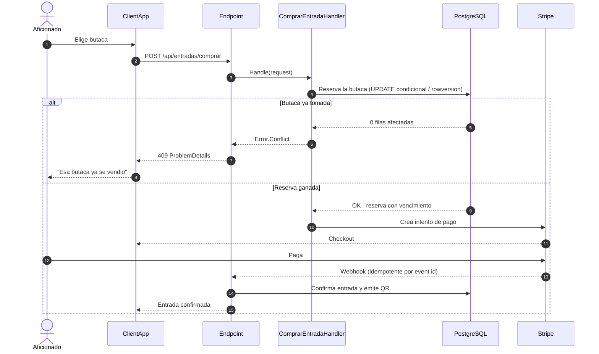

---

## 9. Estado actual (transitorio)

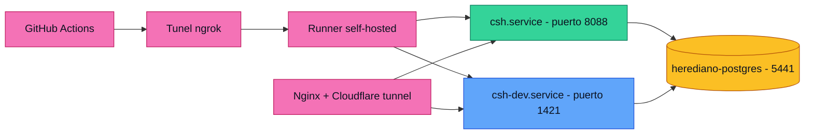
