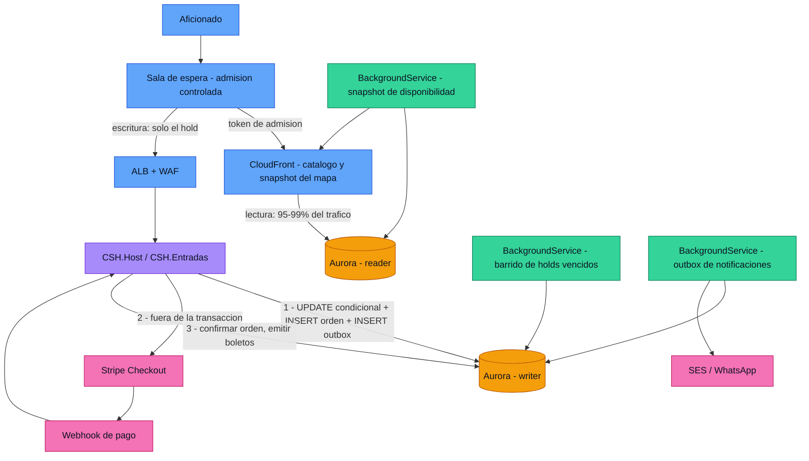

# Pico de apertura de venta

Diseño del comportamiento del sistema cuando se abre la venta de un `Evento` de
alta demanda. Resuelve la pregunta abierta §7.4 de
[`harness_DEV.md`](harness_DEV.md) y el riesgo **R7** del
[acta de constitución](acta-constitucion-proyecto.md).

Extiende [`harness_DEV_backend.md`](harness_DEV_backend.md) §5 (EF Core y
concurrencia). Vocabulario según [`glosario.md`](glosario.md): `Evento`,
`Localidad`, `Orden`, `Boleto`, `Butaca`.

**Estado: propuesta.** `CSH.Entradas` todavía no existe. Nada de este documento
está verificado contra código que compile — igual que la mayor parte del harness
de backend. Se confirma o se desmiente cuando exista el primer módulo.

---

## 1. El problema

La apertura de venta de un clásico no es tráfico alto: es **tráfico
instantáneo**. Miles de personas ejecutan la misma operación sobre el mismo
recurso finito en la misma decena de segundos.

Tres cargas distintas, que se suelen confundir en una sola:

| Carga | Volumen relativo | Naturaleza |
|---|---|---|
| Ver el `Evento`, precios y mapa | 95–99 % | Lectura pura, idéntica para todos |
| Tomar el hold (reservar) | 1–5 % | Escritura contendida sobre pocas filas |
| Confirmar el pago (webhook) | 1–5 %, diferido | Escritura no contendida |

**La primera es la que tumba el sistema, no la segunda.** Es el error de
intuición más caro de este diseño: el instinto lleva a optimizar la transacción
de compra, cuando el volumen está en la gente que solo está mirando el croquis.

Con un aforo del orden de 9 000 asientos, el camino de escritura bien diseñado
no es el cuello de botella: Postgres resuelve cientos de holds por segundo sin
esfuerzo. El cuello de botella son **las decenas de miles de lectores
concurrentes y la tormenta de conexiones** que generan.

### Lo que ya sabemos que sale mal

La aplicación anterior (viva hoy en `main`) tiene los cuatro defectos que este
documento existe para no repetir:

| Defecto | Dónde | Efecto en el pico |
|---|---|---|
| `SELECT … FOR UPDATE` sobre la fila del `Evento` | `entradas.repository.pg.ts` | Serializa **toda** la venta del partido en una fila: techo de ~25–50 órdenes/s |
| `UPDATE` de liberación de reservas en cada `GET` del mapa | `getAsientosPublico()` | Escrituras en la ruta de lectura más caliente |
| El hold solo expira si Stripe avisa, y la sesión no fija `expires_at` (default 24 h) | `payments.stripe.ts` | Inventario fantasma: el evento se muestra `agotado` con butacas libres |
| IDs de butaca sin ordenar en un `UPDATE` multi-fila | `iniciarOrdenPendiente()` | Deadlock entre compras con selección solapada → 500 al aficionado |

Los cuatro son de diseño, no de implementación. Ninguno se arregla con más
servidores.

---

## 2. Principio rector

**La venta de entradas no es CRUD: es asignación de un recurso finito bajo
contención.**

EF Core es la herramienta correcta para el 90 % del proyecto —admin, contenido,
perfiles, parqueo— y es el peor lugar posible para el camino caliente **si se
usa idiomáticamente**. El camino idiomático de EF (`entidad.Stock += n;
SaveChanges()`) es exactamente el bug que sobrevende.

> **Regla.** EF Core para todo. En las cuatro operaciones del camino de compra,
> EF en modo *set-based* (`ExecuteUpdateAsync` o SQL crudo), nunca
> change-tracking.

Y una segunda regla, que gobierna todas las decisiones que siguen:

> **Regla.** La exclusión la garantiza la base, en una sola sentencia. Nunca la
> secuencia leer → decidir en C# → escribir.

---

## 3. El camino de una compra



Las tres escrituras del aficionado están numeradas a propósito: **la 1 es la
única que compite**. La 2 es una llamada HTTP que ocurre después del commit, y
la 3 llega minutos más tarde por un canal distinto y sin contención.

---

## 4. Capa 1 — Admisión en el borde

**Es la decisión de mayor impacto de todo este documento, y hoy no está en
`infra.md`.**

El plan de infraestructura tiene ASG con Warm Pool, scheduled scaling y target
tracking. Nada de eso cubre la apertura: el warm pool tarda entre 30 y 90
segundos en poner instancias `Stopped` en servicio, y los primeros 90 segundos
son los únicos que importan.

La respuesta a un pico de admisión no es escalar, es **controlar quién entra**:

- **Gestionado:** Cloudflare Waiting Room o Queue-it. Es lo más rápido de montar
  y lo que menos código propio agrega.
- **Propio:** token de admisión firmado + contador en DynamoDB o ElastiCache,
  evaluado en **CloudFront Functions / Lambda@Edge**, antes del ALB.

Dos precisiones:

- El **WAF** que ya está planeado sirve contra bots. **No es admisión**: no sabe
  de cupos ni de orden de llegada.
- Si el request de alguien que está en cola llega a tocar `CSH.Host`, la sala de
  espera no está haciendo su trabajo. La cola vive en el borde.

Con esto, el backend ve una tasa de entrada que el club elige —por ejemplo 300
personas por minuto— y todo lo que sigue en este documento pasa a ser holgura en
vez de supervivencia.

---

## 5. Capa 2 — Backend

### 5.1 Separar lectura de escritura desde el diseño

Dos `NpgsqlDataSource` registrados como singleton: uno contra el **writer
endpoint** de Aurora y otro contra el **reader endpoint**.

| | Writer | Reader |
|---|---|---|
| Qué sirve | El hold, la confirmación, el admin | Catálogo, precios, snapshot del mapa |
| Tracking | Solo donde hace falta | `AsNoTracking()` siempre |
| `Multiplexing` | **No** (se desactiva dentro de transacciones) | **Sí** |
| Pool | Chico, timeout corto | Más holgado |

El replica lag de Aurora es de ~1 s. Aceptable para la disponibilidad
*mostrada*, que de todos modos es una estimación. **La decisión de vender va
siempre al writer.**

### 5.2 El mapa de butacas es un asset, no una query

Decenas de miles de personas mirando el croquis no pueden pegarle a Postgres.

Un `BackgroundService` genera cada 2–5 s un snapshot JSON de disponibilidad por
`Localidad` y por `Butaca`, y se sirve con `Cache-Control: max-age=2` desde
CloudFront. La verdad autoritativa se consulta **solo al intentar reservar**,
donde falla limpio con `409` si alguien se adelantó.

El aficionado ve un mapa que puede estar 2 segundos desactualizado. Es el
trade-off correcto: la alternativa es un mapa exacto que nadie puede cargar.

### 5.3 El endpoint del hold es el más corto del sistema

Dentro de la transacción: reservar stock o butacas, insertar la `Orden` en
estado `pendiente`, insertar el evento en la outbox. **Commit.**

Fuera de la transacción, y en este orden: crear la Checkout Session de Stripe,
guardar la referencia.

**Nunca dentro de la transacción:** HTTP, SMTP, WhatsApp, generación de QR. Cada
milisegundo dentro de la transacción se multiplica por la contención.

### 5.4 Idempotencia desde la primera migración

Header `Idempotency-Key` (un GUID por intento de compra, generado por el
cliente) con `UNIQUE` en `entradas.ordenes`.

Bajo un pico —con reintentos de red, usuarios haciendo doble clic y un botón que
tarda en responder— sin esto se duplican holds y se consume inventario que nadie
va a pagar. Agregarlo después obliga a una migración sobre una tabla caliente.

### 5.5 Notificaciones por outbox, nunca en el request

MediatR para eventos entre módulos está bien (harness §7). Lo que no puede pasar
es que el handler de compra dispare el correo en proceso: un pico de 5 000
compras son 5 000 llamadas SMTP bloqueando threads.

**Patrón transactional outbox:** el evento de dominio se inserta en
`entradas.outbox` dentro de la misma transacción del hold; un `BackgroundService`
lo lee y publica. Beneficio doble: la notificación no se pierde aunque el
proceso muera justo después del commit, y no toca la latencia de la compra.

---

## 6. Capa 3 — EF Core y Npgsql

### 6.1 El anti-patrón prohibido

```csharp
// ❌ SOBREVENDE bajo concurrencia. No pasa revisión.
var localidad = await db.Localidades.FindAsync(id, ct);
if (localidad.StockVendido + cantidad > localidad.StockTotal)
    return Error.Conflict("Agotado", "…");
localidad.StockVendido += cantidad;
await db.SaveChangesAsync(ct);
```

Entre el `FindAsync` y el `SaveChangesAsync` hay una ventana. Con READ COMMITTED
—el default de Postgres y de EF— dos requests leen el mismo valor y ambas
escriben. Es el código que un dev escribe naturalmente con EF, y es el bug que
rompe una apertura de venta.

### 6.2 La forma correcta: `UPDATE` condicional

Sigue siendo EF puro. `ExecuteUpdateAsync` genera exactamente el `UPDATE … WHERE`
que hace falta:

```csharp
var filas = await db.Localidades
    .Where(l => l.Id == localidadId
             && l.StockVendido + cantidad <= l.StockTotal)
    .ExecuteUpdateAsync(s => s.SetProperty(
        l => l.StockVendido, l => l.StockVendido + cantidad), ct);

if (filas == 0)
    return Error.Conflict("Localidad agotada",
        "Ya no quedan entradas en esta localidad.");
```

Una sola sentencia: sin lectura previa, sin lock explícito, sin reintento.
Postgres serializa los updates *de esa fila* internamente, y las demás
`Localidad` avanzan en paralelo.

Dos advertencias sobre `ExecuteUpdateAsync`: se ejecuta **inmediatamente** (no
espera al `SaveChangesAsync`) y **no pasa por el change tracker**. Si se combina
con otras escrituras, va dentro de una transacción explícita.

### 6.3 `IsRowVersion()` sí, pero no acá

El harness §5 recomienda hoy un token de concurrencia, y el único ejemplo que da
es `IsRowVersion()`. Para contadores en contención **es la peor de las dos
opciones**: bajo carga alta, todas las requests menos una fallan con
`DbUpdateConcurrencyException` y hay que reintentar, justo cuando menos aguantás.

| Situación | Mecanismo |
|---|---|
| Contador en contención: stock de `Localidad`, cupo de tanda, usos de descuento | `UPDATE` condicional (`ExecuteUpdateAsync`) |
| Estado de una fila única: `Butaca`, plaza de parqueo | `UPDATE … WHERE estado = …` con `RETURNING` |
| Entidad editada por humanos: `Evento`, precios, configuración | `IsRowVersion()` (xmin) — conflicto raro, reintento barato |

Esta distinción es la corrección concreta que este documento le hace al harness.

### 6.4 Butacas numeradas

```csharp
var ids = req.ButacaIds.Order().ToArray();   // ← ordenar: evita deadlocks

var tomadas = await db.Database.SqlQuery<Guid>($"""
    UPDATE entradas.butacas
       SET estado = 'reservado', hold_id = {holdId},
           reservado_hasta = now() + interval '7 minutes'
     WHERE id = ANY({ids})
       AND (estado = 'disponible'
            OR (estado = 'reservado' AND reservado_hasta < now()))
    RETURNING id
    """).ToArrayAsync(ct);

if (tomadas.Length != ids.Length)
    return Error.Conflict("Butaca no disponible",
        "Alguna butaca ya fue tomada. Actualizá el mapa y elegí otras.");
```

**Ordenar los IDs es obligatorio, no cosmético.** Dos compras con selecciones
solapadas en orden inverso deadlockean; Postgres mata una y el aficionado ve un
500. Es un bug real de la aplicación anterior.

### 6.5 Configuración del pool

```
Host=…;Database=csh;Username=…;Password=…;
Maximum Pool Size=25;          ← el default de 100 es peligroso
Minimum Pool Size=5;
Timeout=3;                     ← falla rápido; no esperar 15 s por una conexión
Command Timeout=5;
Connection Idle Lifetime=60;
Max Auto Prepare=20;
Options=-c statement_timeout=5000 -c lock_timeout=3000 -c idle_in_transaction_session_timeout=10000
```

**La cuenta que hay que hacer:** el total de conexiones es
`Maximum Pool Size × instancias del ASG`. Con el default de 100 y un ASG que
escala a 10 instancias son **1 000 conexiones** contra Aurora — colapso mucho
antes de tocar el `max_connections`. Más conexiones no es más throughput: contra
2–4 ACU el óptimo son ~2–4 conexiones por vCPU efectiva.

> **Regla.** `Maximum Pool Size × MaxSize del ASG ≤ 60–70 % del max_connections
> de Aurora`. Si la cuenta no cierra, la respuesta es **RDS Proxy**, no subir el
> pool.

`lock_timeout=3000` es el parámetro que salva la noche: si una transacción se
cuelga sobre una butaca, las demás fallan en 3 s con un `409` limpio en vez de
encolarse hasta agotar el pool.

Registrar el data source como singleton (`AddNpgsqlDataSource`) y pasarlo a
`UseNpgsql(dataSource)`: da pooling correcto, caché de prepared statements
compartida y métricas.

### 6.6 `EnableRetryOnFailure` — necesario, con dos cuidados

Aurora hace failover y escala ACUs; sin retry van a aparecer errores
transitorios. Pero:

1. **Rompe las transacciones explícitas** salvo que se use
   `CreateExecutionStrategy().ExecuteAsync(...)`. Hay que escribirlo así desde el
   primer handler, no descubrirlo en producción.
2. **No debe reintentar un conflicto de negocio.** Si `ExecuteUpdateAsync`
   devuelve 0 filas, eso no es transitorio: es `agotado`. Como el harness ya usa
   `Result<T>` en vez de excepciones para negocio, la separación sale gratis —
   un punto a favor de esa decisión.

---

## 7. Capa 4 — Modelo de datos

### 7.1 El hold expira solo, sin depender de Stripe

1. `expira_at` en la `Orden` en estado `pendiente` (15 minutos).
2. El **mismo** valor en `expires_at` de la Checkout Session de Stripe, para que
   los dos relojes coincidan. El default de Stripe es 24 h: dejarlo así es el bug
   de inventario fantasma que hoy está en producción.
3. Un barrido cada 30 s que devuelve el cupo.

```sql
WITH vencidas AS (
  SELECT id FROM entradas.ordenes
   WHERE estado = 'pendiente' AND expira_at < now()
   ORDER BY expira_at LIMIT 500
   FOR UPDATE SKIP LOCKED          -- ← varias instancias sin pelearse
)
UPDATE entradas.ordenes o SET estado = 'cancelada'
  FROM vencidas v WHERE o.id = v.id
RETURNING o.id;
```

`SKIP LOCKED` es lo que permite que las N instancias del ASG corran el mismo
`BackgroundService` sin coordinación ni elección de líder. Sin él hay que montar
un lock distribuido; con él, no hace falta nada.

### 7.2 Índices del camino caliente, en la primera migración

```sql
CREATE INDEX ON entradas.butacas (evento_id, estado) WHERE estado <> 'vendido';
CREATE INDEX ON entradas.ordenes (expira_at)         WHERE estado = 'pendiente';
CREATE UNIQUE INDEX ON entradas.ordenes (idempotency_key);
CREATE UNIQUE INDEX ON entradas.boletos (codigo);
```

### 7.3 Nunca `COUNT(*)` para disponibilidad

Contador materializado, no agregación. Un
`SELECT count(*) FROM butacas WHERE evento_id = X AND estado = 'disponible'`
sobre miles de filas, multiplicado por miles de req/s, mata el reader. El
contador se mantiene con el mismo `UPDATE` condicional de §6.2.

### 7.4 Contador en tabla estrecha — opcional, solo si la medición lo pide

Tener `stock_vendido` en la misma fila que nombre, precio y descripción hace que
cada venta cree una versión nueva de una fila ancha: más WAL, más bloat, más
trabajo para autovacuum.

Una tabla `entradas.localidad_stock (localidad_id, vendido, total)` con
`fillfactor = 70` mide mejor bajo carga. **Es la única recomendación de este
documento que no haría el día uno**: es una micro-optimización que solo paga si
la prueba de carga la justifica.

---

## 8. Procesos de fondo

Tres `BackgroundService` en `CSH.Host`, todos diseñados para correr en las N
instancias del ASG a la vez:

| Servicio | Cadencia | Cómo evita pisarse |
|---|---|---|
| Barrido de holds vencidos | 30 s | `FOR UPDATE SKIP LOCKED` |
| Snapshot de disponibilidad | 2–5 s | Idempotente: escribe el mismo JSON |
| Publicador de la outbox | 1–5 s | `FOR UPDATE SKIP LOCKED` |

Ninguno necesita elección de líder ni infraestructura nueva. Es deliberado: el
harness ya eligió resolver las migraciones con un advisory lock en vez de un job
aparte, por la misma razón —la base vive en subredes privadas y agregar
componentes cuesta más de lo que ahorra.

---

## 9. Servicios involucrados

### 9.1 AWS

| Servicio | Rol en el pico | ¿Ya está en `infra.md`? |
|---|---|---|
| **CloudFront** | Sirve catálogo, estáticos y el snapshot del mapa. Absorbe el 95–99 % del tráfico | No — **agregar** |
| **CloudFront Functions / Lambda@Edge** | Valida el token de admisión de la sala de espera | No — **agregar** |
| **DynamoDB** o **ElastiCache** | Contador y posiciones de la sala de espera, si se hace propia | No — **agregar** |
| **Route 53** | DNS + health checks + failover a la región DR | Sí |
| **WAF** | Bots y abuso en la apertura. **No es admisión** | Sí |
| **ALB** | Balanceo hacia el ASG | Sí |
| **ASG + EC2 + Warm Pool** | Cómputo. Scheduled scaling **antes** de cada apertura conocida | Sí |
| **EC2 Image Builder** | AMI horneada por release; sin build en el boot | Sí |
| **Aurora PostgreSQL Serverless v2 — writer** | Única fuente de verdad del inventario | Sí |
| **Aurora — reader endpoint** | Catálogo y snapshot. Hoy solo contemplado para analytics | Parcial — **ampliar** |
| **RDS Proxy** | Solo si `Pool × ASG` supera el presupuesto de conexiones | No — **evaluar** |
| **Secrets Manager** | Connection string, llaves de Stripe | Sí |
| **S3** | Estáticos, flyers, snapshots | Sí |
| **SES** | Correo transaccional con el `Boleto` y su QR | Implícito — **fijar** |
| **CloudWatch** | Métricas del pico (§10) y alarmas | Pendiente en `infra.md` |
| **Cognito** | Cuentas del aficionado. **No debe estar en el camino del hold** | Sí |

### 9.2 Externos

| Servicio | Rol | Nota para el pico |
|---|---|---|
| **Stripe Checkout** | Cobro hospedado; la tarjeta nunca toca el servidor | Fijar `expires_at` = expiración del hold |
| **Stripe Webhooks** | Confirma el pago y dispara la emisión del `Boleto` | Debe ser **idempotente**: Stripe reenvía eventos |
| **Cloudflare Waiting Room** o **Queue-it** | Sala de espera gestionada | Alternativa a construirla sobre CloudFront |
| **Twilio / WhatsApp** | Envío opcional del `Boleto` | Siempre por outbox, nunca en el request |

### 9.3 Módulos de la solución

| Proyecto | Qué aporta al pico |
|---|---|
| **`CSH.Entradas`** | Handlers del hold y la confirmación; los tres `BackgroundService` |
| **`CSH.Host`** | Data sources writer/reader, pool, Problem Details, hosting de los servicios de fondo |
| **`CSH.Shared`** | `Result<T>` y `Error` — es lo que permite que un `409` de negocio no sea una excepción y no se reintente |
| **`CSH.Usuarios`** | Identidad. Consultado **antes** del hold, nunca dentro de su transacción |
| **`CSH.Analytics`** | Solo contra el reader. Jamás contra el writer durante una apertura |

---

## 10. Cómo se verifica

### 10.1 Presupuesto de latencia del hold

| Tramo | Objetivo |
|---|---|
| Transacción en Postgres | < 20 ms |
| Handler completo (sin Stripe) | < 100 ms |
| Endpoint extremo a extremo (con Stripe) | p99 < 500 ms |

### 10.2 Prueba de carga — gate de release

Es la mitigación del riesgo **R7** del acta, todavía sin marcar.

- **k6** o **NBomber**, contra un entorno con la topología real (ALB + ASG +
  Aurora). No sirve local.
- Escenario: 20 000 usuarios virtuales en 60 s sobre un `Evento` con el aforo
  completo.
- Criterios de aceptación:
  - **cero sobreventa** (innegociable),
  - p99 del hold < 500 ms,
  - cero timeouts de pool,
  - el barrido de holds vencidos al día al terminar la prueba.

### 10.3 Test unitario obligatorio

El que ya exige [`harness_DEV_testing.md`](harness_DEV_testing.md):
`Handle_DosComprasSimultaneas_SoloUnaGanaLaButaca`, contra Postgres real vía
Testcontainers y **con una conexión por compra**. Está bien planteado; este
documento no lo modifica.

---

## 11. Qué NO cubre este documento

Este documento cubre **el pico**: concurrencia, latencia y capacidad. Eso no es
lo mismo que cubrir la venta. Lo siguiente sigue sin diseñar y hace falta para
que el módulo esté completo:

| Tema | Por qué importa |
|---|---|
| **Límite de boletos por persona** | Sin tope por cuenta o documento, un revendedor se lleva la localidad entera en el primer minuto. Es una regla de negocio, no de infraestructura |
| **Validación en puerta** | Miles de escaneos en 40 minutos, con conectividad de estadio. Necesita modo offline y resolución de duplicados |
| **Reventa / mercado secundario** | Existe en la app anterior (`008_entradas_reventa.sql`). Tiene su propia contención: dos compradores por el mismo `Boleto` |
| **Tandas de preventa, descuentos, promotores RRPP, cortesías** | Todos consumen cupo dentro de la misma transacción y cada uno agrega contención |
| **Reembolsos y reconciliación con Stripe** | Qué pasa con el inventario de una `Orden` reembolsada |
| **Pagos fallidos y webhooks fuera de orden** | Stripe no garantiza orden de entrega |
| **Migración desde la app de `main`** | La pregunta abierta §7.1 del harness: hay gente comprando contra producción hoy |
| **Observabilidad** | Qué se mide y qué dispara una alarma durante una apertura |

**Respuesta corta a "¿con esto ya cubre la venta?": cubre que la venta no se
caiga y no sobrevenda. No cubre todavía las reglas comerciales ni la operación
del día del partido.** Lo de arriba es la lista de lo que falta.

---

## 12. Preguntas abiertas

1. **Aforo real** del Estadio Eladio Rosabal Cordero y distribución por
   `Tribuna`. Este documento asume un orden de magnitud de 9 000 asientos para
   dimensionar; hay que confirmarlo con el club antes de la prueba de carga.
2. **Sala de espera: gestionada o propia.** Cloudflare/Queue-it cuesta
   suscripción y se monta en días; propia sobre CloudFront + DynamoDB no tiene
   costo de licencia pero es código que hay que mantener. Decisión de producto,
   no técnica.
3. **Tasa de admisión** que el club quiere: cuántas personas por minuto entran
   desde la sala de espera. Define todo el dimensionamiento aguas abajo.
4. **RDS Proxy sí o no.** Depende del `MaxSize` final del ASG, que hoy no está
   fijado en `infra.md`.
5. **Reader endpoint durante el pico.** Confirmar que el replica lag de ~1 s es
   aceptable para la disponibilidad mostrada. Si el club lo considera
   inaceptable, la alternativa es snapshot desde el writer con cadencia más baja.

---

## Enlace pendiente con el harness

Este documento vive fuera de `harness_DEV*.md` a propósito: el harness dice que
sus cambios van en su propio PR y se anuncian. Para que esto no quede huérfano
hacen falta dos ediciones, en un PR aparte:

- `harness_DEV.md` §7.4 — reemplazar "sin cubrir todavía: el comportamiento en
  el pico de apertura de venta" por un enlace acá.
- `harness_DEV_backend.md` §5 — la tabla de §6.3 de este documento corrige el
  consejo actual de usar `IsRowVersion()` para todo.
