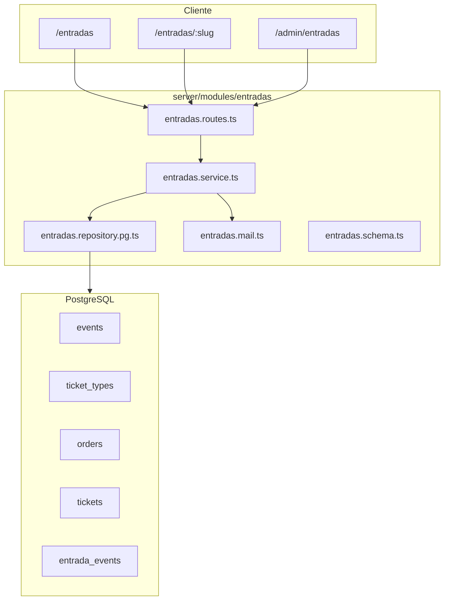
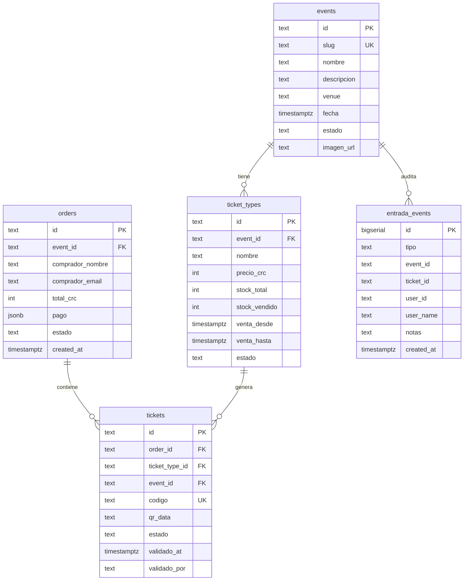
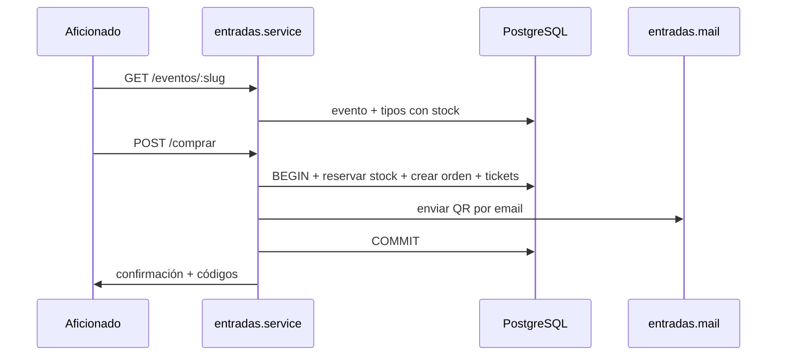
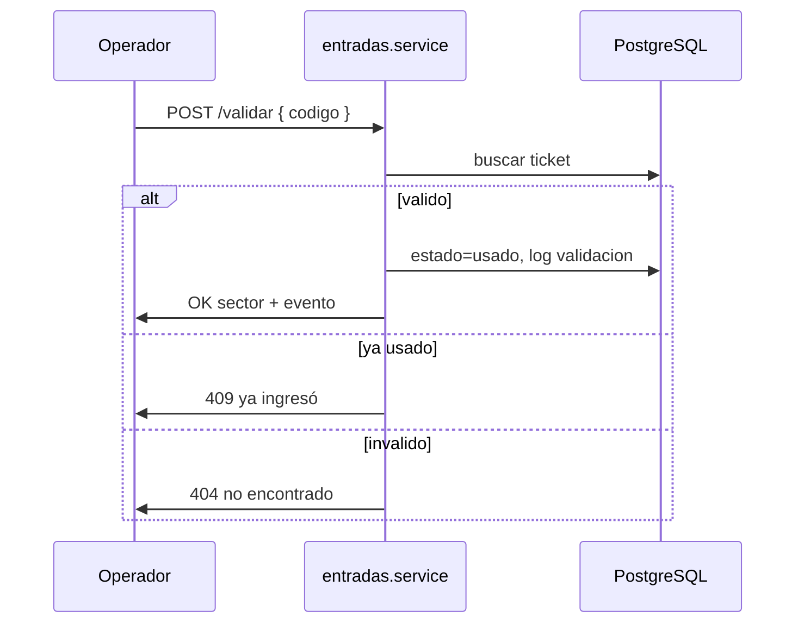

# Plan MVP: Módulo Entradas (estilo Passline) para CSH

**Autor:** JohnRich12  
**Fecha:** 15 de junio de 2026  
**Proyecto:** Club Sport Herediano — APP_CSH

---

## Contexto y objetivo

CSH ya tiene la base operativa en `server/modules/parqueo/` (QR, pago simulado, PostgreSQL, emails) y `src/main.jsx` (SPA pública + admin). El nuevo dominio **entradas** replica ese patrón para vender boletos de partidos en casa del Herediano, inspirado en Passline pero acotado al club.

**Alcance MVP:** catálogo público, compra con QR por email, admin de eventos/tipos, validación en puerta, dashboard de ventas, datos demo y usuarios de prueba.

**Fuera de MVP:** pasarela real, POS físico, cashless, streaming, bundle parqueo+entrada.

---

## Arquitectura



### Nuevo módulo backend

Crear carpeta `server/modules/entradas/` con la misma capa que parqueo:

| Archivo | Responsabilidad |
|---------|-----------------|
| `entradas.types.ts` | `Event`, `TicketType`, `Order`, `Ticket`, `EntradaEvent` |
| `entradas.schema.ts` | `CREATE TABLE` + seed de 1 partido demo con 4 sectores |
| `entradas.repository.ts` | Interfaz + factory `getEntradasRepository()` |
| `entradas.repository.pg.ts` | SQL transaccional (stock atómico) |
| `entradas.helpers.ts` | slug, códigos `ENT-xxx`, payload QR firmado |
| `entradas.mail.ts` | Email confirmación con QR (patrón de `parqueo.mail.ts`) |
| `entradas.service.ts` | Reglas de negocio + `ApiError` |
| `entradas.routes.ts` | Rutas públicas y admin |

**Integración:**

- Registrar `entradasRouter` en `server/app.ts` antes de `registerProxy`.
- Llamar `ensureEntradasSchema()` en `server/index.ts` junto a parqueo/usuarios.
- Agregar ruta SPA `/entradas` y `/entradas/*` en `server/modules/proxy/proxy.routes.ts`.
- Agregar enlace "Entradas" en `server/modules/proxy/proxy.nav.ts`.

---

## Modelo de datos PostgreSQL



**Estados clave:**

- Evento: `borrador` → `publicado` → `agotado` | `finalizado`
- Ticket: `valido` → `usado` | `cancelado`
- Orden: `pagada` | `cancelada`

**Stock atómico** (dentro de transacción en compra):

```sql
UPDATE ticket_types
SET stock_vendido = stock_vendido + $qty
WHERE id = $id AND stock_vendido + $qty <= stock_total
RETURNING *
```

**Seed demo** en `entradas.schema.ts`:

- Evento: `herediano-vs-saprissa-demo` (borrador y otro `publicado`)
- Tipos: Sur (₡8.000), Norte (₡8.000), Palco (₡25.000), Socio (₡5.000) con stock 500/500/50/200

---

## API

### Público (`/api/entradas/publico/`)

| Método | Ruta | Descripción |
|--------|------|-------------|
| GET | `/eventos` | Partidos `publicado` con stock disponible |
| GET | `/eventos/:slug` | Detalle + tipos activos |
| POST | `/comprar` | `{ slug, lineas: [{tipoId, cantidad}], comprador: {nombre, email}, pago }` |
| POST | `/consulta` | `{ email, codigo }` → estado del boleto |
| POST | `/reenviar` | Reenvío QR por email (como parqueo) |

Pago: reutilizar validación de `parqueo.service.ts` (tarjeta termina en `0000` = rechazo).

### Admin (`/admin/api/entradas/` + `requireAdmin`)

| Método | Ruta | Rol mínimo | Acción |
|--------|------|------------|--------|
| GET | `/eventos` | operador | Listar eventos |
| POST | `/eventos` | admin | Crear evento |
| PUT | `/eventos/:id` | admin | Editar |
| POST | `/eventos/:id/estado` | admin | publicar/cerrar |
| POST | `/eventos/:id/tipos` | admin | Crear tipo entrada |
| PUT | `/tipos/:id` | admin | Editar precio/stock/fechas |
| GET | `/ventas` | operador | Resumen global |
| GET | `/ventas/:eventId` | operador | Detalle por partido |
| POST | `/validar` | operador | Validar QR/código en puerta |
| POST | `/cortesia` | admin | Emitir boleto gratis |
| GET | `/log` | admin | Auditoría |

Helpers de permisos en `entradas.service.ts` (patrón `canManageCoupons` de `cuponera.service.ts`):

- `canManageEvents(user)` → `eventsRole === 'admin'`
- `canOperateGate(user)` → `admin` | `operador`
- `canViewSales(user)` → `admin` | `operador` | `comercial`

---

## Roles y usuarios de prueba

Extender `AdminUser` en `server/modules/usuarios/usuarios.data.ts`:

```typescript
eventsRole: 'admin' | 'operador' | 'comercial' | 'ninguno'
```

### Usuarios existentes (actualizar)

| ID | Usuario | Password | eventsRole | Para probar |
|----|---------|----------|------------|-------------|
| u-001 | `admin` | (env `ADMIN_PASS`) | `admin` | CRUD completo, cortesías, publicar |
| u-002 | `operaciones` | `operaciones1921` | `operador` | Validar QR + ver ventas (multi-módulo) |
| u-003 | `comercial` | `comercial1921` | `comercial` | Solo lectura ventas |
| u-004 | `socio1` | `socio1921` | `ninguno` | Verificar 403 en admin entradas |

### Usuarios nuevos (crear)

| ID | Usuario | Password | Nombre | eventsRole | parkingRole | couponRole | Para probar |
|----|---------|----------|--------|------------|-------------|------------|-------------|
| u-005 | `taquilla` | `taquilla1921` | Taquilla Estadio | `operador` | `invitado` | `ninguno` | Solo puerta, sin parqueo/cupones |
| u-006 | `eventos` | `eventos1921` | Gestor de Eventos | `admin` | `invitado` | `ninguno` | Solo gestión entradas, sin parqueo |

Actualizar `listUsers()` en `server/modules/usuarios/usuarios.service.ts` para exponer `eventsRole` en la UI de usuarios.

---

## Frontend (`src/main.jsx`)

Mantener SPA monolítica; agregar rutas y componentes siguiendo parqueo/cuponera.

### Rutas públicas

Actualizar `App()`:

```javascript
if (path.startsWith('/entradas')) return <PublicEntradas />;
```

- `/entradas` → `PublicEntradasList` (cards de partidos, estilo `PublicCoupons`)
- `/entradas/:slug` → `PublicEventDetail` (sectores, cantidades, checkout)
- Reutilizar `PaymentModal` adaptado para total de entradas
- Header público: agregar enlace "Entradas" junto a Cuponera/Parqueo

### Rutas admin

- `/admin/entradas` → `AdminEntradas` (lista + crear/editar/publicar)
- Sub-vistas en la misma ruta con tabs o query:
  - **Eventos** — CRUD partidos y tipos
  - **Ventas** — tabla ingresos/stock (visible si `canViewSales`)
  - **Puerta** — input código/QR para validar (visible si `canOperateGate`)

Sidebar admin: botón "Entradas" con icono `Ticket` (o `CalendarDays`), condicionado a `eventsRole !== 'ninguno'`.

`AdminHome`: tarjeta de acceso rápido a Entradas.

---

## Flujo de compra (cliente)



---

## Flujo de validación (admin/operador)



---

## Plan de implementación por fases

### Fase 1 — Backend + usuarios + seed (base)

- Schema PG + seed demo
- Módulo completo backend (types, repo, service, routes)
- Extender `AdminUser` + 2 usuarios nuevos + actualizar existentes
- Registrar router y bootstrap
- Typecheck: `npm run build:server`

### Fase 2 — Admin UI

- `AdminEntradas`: lista eventos, formulario crear/editar, gestión tipos, publicar
- Tab ventas (solo lectura para comercial/operador)
- Tab puerta (validación código)
- Sidebar condicionado por `eventsRole`

### Fase 3 — Cliente público

- Catálogo `/entradas` + detalle `/entradas/:slug`
- Checkout con `PaymentModal` reutilizado
- Consulta y reenvío de boleto
- Nav proxy + header público

### Fase 4 — QA manual con usuarios demo

| Escenario | Usuario | Resultado esperado |
|-----------|---------|-------------------|
| Crear y publicar partido | `eventos` / `eventos1921` | Evento visible en público |
| Comprar 2 entradas Sur | (público, sin login) | Email QR + stock -2 |
| Validar boleto en puerta | `taquilla` / `taquilla1921` | Marca `usado` |
| Re-validar mismo boleto | `taquilla` | Error "ya ingresó" |
| Ver ventas | `comercial` / `comercial1921` | Dashboard OK, sin CRUD |
| Acceder admin entradas | `socio1` / `socio1921` | 403 o menú oculto |
| Cortesía | `admin` | Boleto gratis sin pago |

---

## Archivos principales a tocar

**Nuevos (8):**

- `server/modules/entradas/*` (8 archivos del módulo)

**Modificar (~8):**

- `server/app.ts`
- `server/index.ts`
- `server/modules/usuarios/usuarios.data.ts`
- `server/modules/usuarios/usuarios.service.ts`
- `server/modules/proxy/proxy.routes.ts`
- `server/modules/proxy/proxy.nav.ts`
- `src/main.jsx`
- `src/styles.css` — estilos mínimos para cards de eventos

---

## Decisiones fijadas

- **Persistencia:** solo PostgreSQL (sin JSON fallback).
- **Pago:** simulado igual que parqueo en MVP.
- **QR:** payload `codigo|eventId|tipoId|email` + código legible `ENT-xxxx`.
- **Moneda:** CRC (colones), consistente con parqueo.
- **Idioma UI/API:** español CR, como el resto de CSH.

---

## Checklist de tareas

- [ ] Crear `server/modules/entradas/` con schema PG, types, helpers, repository.pg, service, routes, mail
- [ ] Agregar `eventsRole` a AdminUser, actualizar u-001..u-004 y crear u-005 taquilla + u-006 eventos
- [ ] Registrar `entradasRouter` en app.ts, `ensureEntradasSchema` en index.ts, rutas SPA y nav proxy
- [ ] Implementar `AdminEntradas` en main.jsx: CRUD eventos, tipos, ventas, validación puerta
- [ ] Implementar `PublicEntradasList` + `PublicEventDetail` + checkout reutilizando PaymentModal
- [ ] Probar flujos con los 6 usuarios demo y partido seed `herediano-vs-saprissa-demo`
