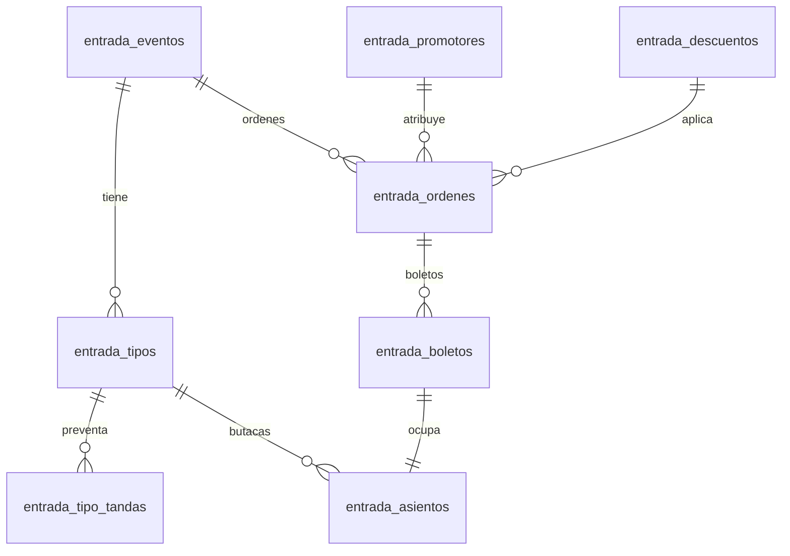

# Plan spec-driven: Entradas P1 + Asientos numerados + WhatsApp + Info/Contacto

**Proyecto:** APP_CSH (Club Sport Herediano) · **Módulo:** `entradas`
**Nota de proceso:** el repo no usa un framework formal de spec (no hay `specs/`/EARS). La
convención de la casa es un `plan-<feature>.md` en la raíz al estilo de `plan-entradas-mvp.md`.
Al ejecutar, **materializar este documento como `/home/tony/Desktop/APP_CSH/plan-entradas-p1.md`**
y trabajar en rama feature (nunca `main`). Aquí se escribe **spec-first**: cada feature lleva
Requisitos + Criterios de aceptación (formato `CUANDO… ENTONCES…`) antes del diseño.

## Contexto

John toma el **P0** (pasarela de pago real) por separado — **este plan lo ignora** y asume que
el pago sigue pasando por `validatePago` en `entradas.service.ts` (se integrará después). Este
plan cubre: **P1 completo** (RRPP, códigos de descuento, cargo por servicio, preventa/early bird),
la pieza de **P2 pendiente** (estadio con **asientos numerados individuales**), el **módulo de
notificación por WhatsApp** (Meta Cloud API, además del email actual) y una sección pública de
**Más información + Contáctenos** en el flujo de entradas.

**Alcance.** Todo lo anterior. **Fuera de alcance:** pasarela real (P0/John), reembolsos,
multi-organizador, wallet passes, SMS, self-service login para promotores (se deja como futuro).

**Decisiones fijadas (respuestas del usuario):**
- WhatsApp vía **Meta WhatsApp Cloud API** (requiere número verificado + plantillas aprobadas).
- Asientos **todo numerado**: cada sector con butacas individuales (fila/asiento).
- P1 = los 4 features.
- Promotores viven **dentro del módulo `entradas`** (no módulo aparte) para MVP.
- FAQ de "Más información" es **estático** (`src/data/entradasInfo.js`) para MVP; editable luego.
- "Contáctenos" **reutiliza** el backend existente `POST /api/contacto` (asunto `Entradas`).

---

## Arquitectura (dónde se enchufa)

```mermaid
flowchart TD
  subgraph Público [SPA pública /entradas]
    L[PublicEntradasList] --> D[PublicEventDetail]
    D --> SM[StadiumMap: selección de asiento]
    D --> CO[CheckoutModal: descuento + fee + tel/WA]
    L --> INFO[Info + Contáctenos]
  end
  subgraph Admin [/admin/entradas]
    EV[Eventos/Tipos] --> ED[StadiumMapEditor: generar butacas]
    PR[Promotores] --> RANK[Ranking ventas]
    DE[Descuentos]
    FEE[Fee por evento]
  end
  CO --> API[/api/entradas/publico/comprar/]
  API --> SVC[entradas.service.ts]
  SVC --> REPO[entradas.repository.pg.ts · TX asientos+orden]
  SVC --> MAIL[entradas.mail.ts]
  SVC --> WA[entradas.whatsapp.ts → core/whatsapp.ts → Graph API]
```

Convención de módulo (ya existente): `server/modules/entradas/entradas.<capa>.ts`
(`types` · `schema` · `repository` + `repository.pg` · `service` · `routes` · `helpers` · `mail`).
Registro de router en `server/app.ts`; `ensureEntradasSchema()` en `server/index.ts`.
Admin: sub-pestañas dentro del panel Entradas en `src/app-modules.jsx`. Público: rutas hijas de
`<ServiceLayout>` en `src/main.jsx` (`/entradas/*` ya existe).

---

## Modelo de datos (cambios PostgreSQL)



**Tablas nuevas**
- `entrada_promotores(id, nombre, codigo UNIQUE, comision_tipo 'pct'|'crc', comision_valor, activo, creado_at)`
- `entrada_descuentos(id, codigo UNIQUE, tipo 'pct'|'monto', valor, evento_id NULL, usos_max NULL, usos_actuales, vigencia_desde NULL, vigencia_hasta NULL, activo)`
- `entrada_tipo_tandas(id, tipo_id FK, nombre, precio_crc, venta_desde NULL, venta_hasta NULL, cupo NULL, orden)` — "tanda" de precio (early bird). Precio activo = tanda vigente por fecha con cupo disponible; si ninguna, cae al `precio_crc` base del tipo.
- `entrada_asientos(id, evento_id FK, tipo_id FK, fila, numero, x, y, estado 'disponible'|'reservado'|'vendido'|'bloqueado', reservado_hasta NULL, boleto_id NULL, orden_id NULL, UNIQUE(evento_id,tipo_id,fila,numero))`
- `entrada_config(id=1 singleton, fee_tipo_default 'pct'|'crc'|'ninguno', fee_valor_default)` — default global de cargo por servicio.

**Modificaciones**
- `entrada_eventos`: + `fee_tipo 'pct'|'crc'|'ninguno' NULL`, `fee_valor NULL` (override del default global).
- `entrada_tipos`: + `numerado BOOL DEFAULT true`. El stock deja de ser la verdad; el aforo real
  = conteo de `entrada_asientos` `disponible`. `stock_total/vendido` se mantienen como derivados
  para los dashboards existentes (recalcular desde asientos).
- `entrada_ordenes`: + `subtotal_crc`, `fee_crc`, `descuento_crc`, `descuento_codigo NULL`,
  `promotor_id NULL FK`, `comision_crc`, `comprador_telefono NULL`, `notif_whatsapp BOOL DEFAULT false`.
  (`total_crc` ya existe; `total = subtotal - descuento + fee`.)
- `entrada_boletos`: + `asiento_id NULL FK` (cada boleto referencia su butaca).

Migraciones nuevas en `migrations/` (`005_entradas_p1.sql`, `006_entradas_asientos.sql`) **y** en
runtime dentro de `entradas.schema.ts` (fuente de verdad por comentario del repo). Idempotentes
(`ADD COLUMN IF NOT EXISTS`).

---

## Feature 1 — Cargo por servicio (fee)

**Requisitos.** El club puede configurar un cargo por servicio global y sobreescribirlo por evento.
- CA1: CUANDO existe `entrada_config.fee` y un evento sin override, ENTONCES el checkout aplica el fee global.
- CA2: CUANDO un evento define `fee_tipo/fee_valor`, ENTONCES prevalece sobre el global.
- CA3: CUANDO se calcula el total, ENTONCES el desglose `subtotal / descuento / fee / total` se recomputa **en el servidor** y se guarda en `entrada_ordenes` (nunca confiar en el cliente).
- CA4: El checkout muestra el desglose línea por línea antes de pagar.

**Diseño.** Helper `calcularTotales({tipos, cantidades, descuento, feeEvento})` en
`entradas.helpers.ts` (con test). Admin: campo fee en `EventDetalleModal` + pantalla de config
global. Público: líneas de desglose en `CheckoutModal`.

## Feature 2 — Códigos de descuento

**Requisitos.**
- CA1: CUANDO el comprador ingresa un código válido, vigente y con usos disponibles, ENTONCES se previsualiza el descuento sin cerrar la compra (`POST /api/entradas/publico/validar-descuento`).
- CA2: CUANDO el código es de un evento distinto / vencido / sin usos / inactivo, ENTONCES se rechaza con mensaje claro (400).
- CA3: CUANDO se confirma la compra, ENTONCES el descuento se **re-valida y aplica en el servidor** dentro de la misma transacción y se incrementa `usos_actuales` atómicamente.
- CA4: El admin hace CRUD de descuentos (global o por evento) con vigencia y límite de usos.

**Diseño.** `entradas.repository.pg.ts`: `validarDescuento(codigo, eventoId)` y consumo atómico en
`comprar()`. Admin sub-pestaña **Descuentos**. Público: campo "¿Tenés un código?" en `CheckoutModal`.

## Feature 3 — Preventa / early bird (tandas)

**Requisitos.**
- CA1: CUANDO hay una tanda vigente (fecha dentro de `[venta_desde, venta_hasta]`) con cupo disponible, ENTONCES el precio del tipo = precio de esa tanda.
- CA2: CUANDO se agota el `cupo` de una tanda o pasa su `venta_hasta`, ENTONCES el sistema usa la siguiente tanda por `orden`; si no hay, el `precio_crc` base.
- CA3: La UI pública muestra el nombre de la tanda activa (ej. "Preventa") y su precio.
- CA4: El admin gestiona tandas por tipo de entrada (nombre, precio, ventana, cupo, orden).

**Diseño.** `precioActivoTipo(tipo, tandas, now, vendidosPorTanda)` en `entradas.helpers.ts` (test).
Se resuelve server-side en el listado público y en `comprar()`. Admin: editor de tandas dentro del
tipo en `EventDetalleModal`.

## Feature 4 — RRPP / promotores

**Requisitos.**
- CA1: CUANDO se visita `/entradas/:slug?ref=CODIGO`, ENTONCES el código se persiste (sessionStorage) y viaja en el payload de compra.
- CA2: CUANDO una orden trae un `ref` de promotor activo, ENTONCES se guarda `promotor_id` y se calcula `comision_crc` según su `comision_tipo/valor` sobre el subtotal.
- CA3: El admin hace CRUD de promotores (genera código único) y ve un **ranking**: ventas, entradas, ₡ y comisión por promotor.
- CA4: CUANDO el código de promotor no existe/está inactivo, ENTONCES la compra procede **sin** atribución (no falla).

**Diseño.** Tabla `entrada_promotores`; `promotor_id` en la orden. Reporte
`ventasPorPromotor()` en repositorio. Admin sub-pestaña **Promotores** (CRUD + ranking + botón
"copiar link" → `${APP_URL}/entradas/:slug?ref=CODIGO`). Util frontend `capturarRef()` leído en
`PublicEventDetail`. Sin login de promotor en MVP (solo códigos + dashboard admin).

## Feature 5 — Asientos numerados (P2, todo numerado)

**Requisitos.**
- CA1: CUANDO el admin genera butacas para un sector (filas × asientos), ENTONCES se crean filas en `entrada_asientos` con coordenadas y estado `disponible`.
- CA2: CUANDO un comprador selecciona butacas en el mapa, ENTONCES quedan en `reservado` con `reservado_hasta = now + N min` (soft-lock) para evitar doble venta.
- CA3: CUANDO se confirma el pago, ENTONCES las butacas seleccionadas pasan a `vendido` y se ligan a un `boleto` **en una sola transacción**; si alguna ya no está disponible, la compra falla y se liberan las demás.
- CA4: CUANDO expira `reservado_hasta` sin compra, ENTONCES un barrido (o verificación perezosa al leer) devuelve la butaca a `disponible`.
- CA5: El mapa público muestra butacas disponibles/ocupadas/seleccionadas; el aforo por sector = conteo real de asientos.
- CA6: El admin puede **bloquear** butacas (`bloqueado`) para cortesías/prensa.

**Diseño.**
- Backend: `entrada_asientos` + métodos `generarAsientos`, `reservarAsientos` (soft-lock TX),
  `confirmarAsientos`, `liberarExpirados`, `bloquearAsiento`. `comprar()` cambia de "decrementar
  stock" a "confirmar asientos". Boleto ← `asiento_id`. Endpoints:
  `GET /api/entradas/publico/eventos/:slug/asientos`, `POST …/reservar-asientos` (opcional soft-lock),
  admin `POST /admin/api/entradas/tipos/:id/asientos/generar`, `PATCH …/asientos/:id`.
- Frontend: extender `src/pages/entradas/StadiumMap.jsx` (render + selección de butaca) y
  `StadiumMapEditor.jsx` (generador grilla filas×asientos, reposicionar, bloquear). `CheckoutModal`
  usa la lista de `asiento_id` seleccionados en vez de cantidades.
- **Es la fase más pesada**: toca modelo, concurrencia, editor y checkout. Migrar eventos existentes
  generando butacas por sector a partir del `stock_total` actual (script de migración).

## Feature 6 — Notificaciones por WhatsApp (Meta Cloud API)

**Requisitos.**
- CA1: CUANDO el comprador ingresa teléfono y marca consentimiento WhatsApp, ENTONCES tras la compra recibe la confirmación por WhatsApp **además** del email.
- CA2: CUANDO WhatsApp falla o está deshabilitado (`WHATSAPP_ENABLED=false`), ENTONCES la compra y el email **no** se ven afectados (envío no-fatal, en paralelo al email).
- CA3: El mensaje inicial usa una **plantilla aprobada** (mensaje business-initiated, sin ventana de 24h abierta) con nombre de evento, fecha y venue; el QR se entrega como imagen/documento o link a "ver mis entradas".
- CA4: Reenvío y cortesía también pueden notificar por WhatsApp si hay teléfono/consentimiento.

**Diseño.**
- **`server/core/whatsapp.ts`** (nuevo, análogo a `core/mailer.ts`): cliente de bajo nivel contra
  `https://graph.facebook.com/${WHATSAPP_API_VERSION}/${WHATSAPP_PHONE_ID}/messages` con
  `WHATSAPP_TOKEN`; funciones `sendTemplate({to, template, variables})`, `uploadMedia(png)`,
  `sendImage({to, mediaId, caption})`. Respeta flag `WHATSAPP_ENABLED`.
- **`server/modules/entradas/entradas.whatsapp.ts`** (nuevo): `sendEntradasWhatsApp({to, evento, boletos})`
  que compone la plantilla + QR. Disparado junto a `sendEntradasEmail` en `comprarPublico`,
  `reenviarPublico`, `adminCortesia` (mismos try/catch no-fatales).
- **Env nuevos** en `server/config/env.ts` + `.env.example` + `ALL_SECRETS.example`:
  `WHATSAPP_ENABLED`, `WHATSAPP_PHONE_ID`, `WHATSAPP_TOKEN`, `WHATSAPP_API_VERSION` (default `v21.0`),
  `WHATSAPP_TEMPLATE_ENTRADAS`.
- Frontend: campo teléfono + checkbox consentimiento en `CheckoutModal`.
- **Pre-requisito operativo (fuera de código):** número de WhatsApp Business verificado y plantilla
  `entrada_confirmacion` aprobada en Meta. Documentar en el README del módulo.

## Feature 7 — Más información + Contáctenos (público)

**Requisitos.**
- CA1: La landing pública de entradas muestra un bloque de **Más información / FAQ** (cómo comprar,
  ingreso con QR, políticas de asientos, reventa).
- CA2: Muestra un bloque **Contáctenos** con click-to-chat de WhatsApp (número de `src/data/club.js`)
  y un mini-form que postea a `POST /api/contacto` con `asunto = "Entradas"`.
- CA3: CUANDO se envía el mini-form, ENTONCES aparece en el inbox admin existente (`/admin/mensajes`).

**Diseño.** Nuevo `src/data/entradasInfo.js` (FAQ estática). Componentes `EntradasInfo` +
`EntradasContacto` en `src/app-modules.jsx`, renderizados en `PublicEntradasList` tras
`BoletoLookup`. Reutiliza el endpoint `contacto` (sin backend nuevo).

---

## API (resumen)

### Público (`/api/entradas/publico/...`)
| Método | Ruta | Descripción |
|---|---|---|
| GET | `/eventos/:slug/asientos` | Mapa de butacas con estado |
| POST | `/reservar-asientos` | Soft-lock temporal de butacas (opcional) |
| POST | `/validar-descuento` | Previsualiza descuento por código |
| POST | `/comprar` | (mod) desglose fee/descuento, asientos, promotor, tel/WA |

### Admin (`/admin/api/entradas/...`, `requireAdmin` + `canManageEvents`)
| Método | Ruta | Descripción |
|---|---|---|
| GET/POST/PUT/DELETE | `/promotores` | CRUD promotores |
| GET | `/promotores/ranking` | Ranking de ventas/comisión |
| GET/POST/PUT/DELETE | `/descuentos` | CRUD códigos de descuento |
| POST | `/tipos/:id/tandas` … | CRUD tandas early bird |
| POST | `/tipos/:id/asientos/generar` | Generar butacas (filas×asientos) |
| PATCH | `/asientos/:id` | Bloquear/editar butaca |
| GET/PUT | `/config` | Fee por servicio global |

---

## Plan de implementación por fases

- **Fase 1 — Modelo de orden (fee + descuento).** Migraciones de columnas de orden + `entrada_descuentos`
  + `entrada_config`; helper `calcularTotales`; `validarDescuento`; checkout con desglose. *(fundacional)*
- **Fase 2 — Preventa/tandas.** `entrada_tipo_tandas`; `precioActivoTipo`; resolución server-side; editor.
- **Fase 3 — Asientos numerados.** `entrada_asientos`; soft-lock TX; `comprar()` por butaca; editor +
  mapa público; script de migración de eventos existentes. *(la más pesada)*
- **Fase 4 — RRPP/promotores.** `entrada_promotores`; atribución + comisión; sub-pestaña + ranking; `ref` capture.
- **Fase 5 — WhatsApp.** `core/whatsapp.ts`; `entradas.whatsapp.ts`; env; campo tel/consentimiento; disparadores.
- **Fase 6 — Info + Contáctenos.** `entradasInfo.js`; bloques públicos; reutilizar `/api/contacto`.

Cada fase: `schema → types → repository(.pg) → service → routes → *.test.ts → frontend`, con
`npm run check` + `npm run build:server` + `vitest` antes de cerrar (según `docs/harness.md`).

---

## Archivos principales a tocar

**Nuevos**
- `migrations/005_entradas_p1.sql`, `migrations/006_entradas_asientos.sql`
- `server/core/whatsapp.ts`
- `server/modules/entradas/entradas.whatsapp.ts`
- `src/data/entradasInfo.js`
- `plan-entradas-p1.md` (materialización de este spec en la raíz)

**Modificar**
- `server/modules/entradas/entradas.{schema,types,repository,repository.pg,service,routes,helpers}.ts`
  y `*.test.ts`
- `server/config/env.ts`, `.env.example`, `ALL_SECRETS.example`
- `server/index.ts` (bootstrap de schema si aplica)
- `src/app-modules.jsx` (CheckoutModal, PublicEntradasList, sub-pestañas admin Promotores/Descuentos/Fee)
- `src/pages/entradas/StadiumMap.jsx`, `StadiumMapEditor.jsx`

## Decisiones fijadas
- P0 (pago real) lo hace John → aquí el pago sigue simulado (`validatePago`).
- WhatsApp = Meta Cloud API con plantilla aprobada; envío no-fatal en paralelo al email.
- Asientos = todos numerados; aforo real = conteo de `entrada_asientos`; `stock_*` queda derivado.
- Descuento/fee/comisión se recalculan siempre en el servidor y se guardan desglosados en la orden.
- Promotores sin login propio en MVP (solo códigos + dashboard admin).
- FAQ estático; Contáctenos reutiliza el módulo `contacto`.

## Checklist
- [ ] Fase 1: fee + descuentos (migración, helper, validación, checkout desglosado, tests)
- [ ] Fase 2: tandas early bird (schema, precio activo, editor, tests)
- [ ] Fase 3: asientos numerados (schema, soft-lock TX, comprar por butaca, editor + mapa, migración eventos)
- [ ] Fase 4: promotores (CRUD, atribución+comisión, ranking, ref capture)
- [ ] Fase 5: WhatsApp (core/whatsapp, entradas.whatsapp, env, checkout tel/consent, disparadores)
- [ ] Fase 6: Info + Contáctenos público
- [ ] Documentar pre-requisito Meta (número verificado + plantilla) en README del módulo

## Verificación
- **Unit:** `vitest` — nuevos tests de `calcularTotales`, `precioActivoTipo`, `validarDescuento`,
  reserva/confirmación de asientos, atribución de comisión.
- **Integración local:** `docker-compose up` (postgres:16) + `npm run dev`; flujo completo:
  aplicar descuento → seleccionar butacas → ver fee en desglose → comprar con `?ref=CODIGO` →
  recibir email + WhatsApp (o `WHATSAPP_ENABLED=false`) → validar QR en puerta → butaca queda `vendido`
  → ranking de promotor refleja la venta.
- **Concurrencia asientos:** dos compras simultáneas de la misma butaca → una falla limpia.
- **Dev público:** desplegar en 1421 (`herediano-dev.milocalhost.work`) y probar sin auth.
- **Validación de handoff:** `npm run check` + `npm run build:server` verdes (según `docs/harness.md`).
```
